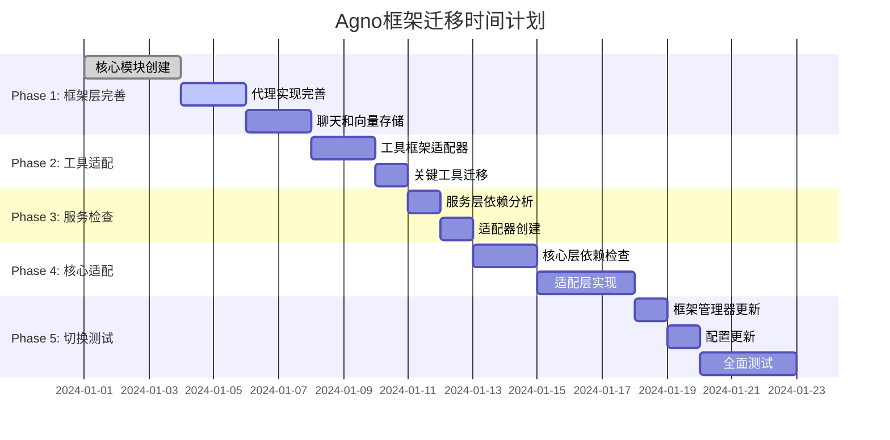

# LlamaIndex到Agno框架迁移实施文档

## 目录
1. [项目概述](#项目概述)
2. [迁移策略与原则](#迁移策略与原则)
3. [当前架构分析](#当前架构分析)
4. [详细实施计划](#详细实施计划)
5. [风险评估与缓解](#风险评估与缓解)
6. [时间计划与里程碑](#时间计划与里程碑)
7. [验收标准](#验收标准)
8. [附录](#附录)

---

## 项目概述

### 任务目标
**在保持API路由设计完全不变的前提下**，将ZZDSJ后端API系统的LlamaIndex框架功能全部替换为Agno框架实现，确保业务连续性和系统稳定性。

### 核心价值主张
- **业务零中断**: API接口保持不变，确保前端和外部系统无感知迁移
- **框架层替换**: 在frameworks层实现完整的功能对等替换
- **渐进式迁移**: 按优先级逐层迁移，每个阶段都可独立验证
- **兼容性保证**: 保持方法名和调用签名一致，只替换内部实现

### 影响范围
- **主要影响**: `app/frameworks/` - 框架层完整重构
- **次要影响**: `app/tools/` - 工具适配
- **检查范围**: `app/services/`, `core/` - 依赖适配
- **保持不变**: `app/api/` - API路由和接口保持完全不变

---

## 迁移策略与原则

### 2.1 核心迁移策略

#### 🎯 **API层保护策略**
```python
# API层调用保持完全不变
# BEFORE & AFTER - 完全相同的调用方式
from app.frameworks.manager import FrameworkManager
framework_manager = FrameworkManager()
result = await framework_manager.process_query(query, framework_type="default")
```

#### 🔄 **框架层替换策略** 
```python
# frameworks层内部实现替换
# BEFORE: 内部使用LlamaIndex
# AFTER: 内部使用Agno，但接口完全一致

# app/frameworks/factory.py
def create_processor(framework_type: str):
    if framework_type == "llamaindex":
        return LlamaIndexProcessor()  # 原实现
    elif framework_type == "agno":
        return AgnoProcessor()        # 新实现，接口相同
```

#### 📐 **接口兼容性原则**
1. **方法签名一致**: 所有公共方法的参数、返回值类型完全相同
2. **响应格式统一**: 数据结构和字段名保持一致
3. **异常处理一致**: 错误类型和消息格式保持一致
4. **配置参数兼容**: 支持相同的配置选项

### 2.2 迁移优先级

#### **Phase 1: Agno框架层完善** 🚀
- **目标**: 在`app/frameworks/agno/`中实现对LlamaIndex功能的完整对等
- **优先级**: 最高
- **验证**: 通过框架切换测试验证兼容性

#### **Phase 2: 工具层适配** 🛠️
- **目标**: 将`app/tools/`中能用Agno实现的工具替换为Agno实现
- **原则**: 保持工具接口不变，只替换内部框架调用
- **验证**: 工具功能测试通过

#### **Phase 3: 服务层检查** 🔍
- **目标**: 检查`app/services/`中的框架依赖，确保兼容性
- **策略**: 通过适配器模式处理框架差异
- **验证**: 服务层集成测试通过

#### **Phase 4: 核心层适配** ⚙️
- **目标**: 适配`core/`层的框架调用
- **策略**: 保持核心层接口不变，通过框架管理器处理
- **验证**: 核心功能测试通过

#### **Phase 5: 配置切换** 🎛️
- **目标**: 将默认框架从LlamaIndex切换到Agno
- **策略**: 通过配置管理器实现无缝切换
- **验证**: 全量回归测试通过

---

## 当前架构分析

### 3.1 LlamaIndex框架层分析

#### 核心模块结构 (需要Agno对等实现)
```
app/frameworks/llamaindex/
├── indexing.py (408行)          → app/frameworks/agno/indexing.py
├── retrieval.py (564行)         → app/frameworks/agno/retrieval.py  
├── document_processor.py (828行) → app/frameworks/agno/document_processor.py
├── agent.py (221行)             → app/frameworks/agno/agent.py (需完善)
├── chat.py (126行)              → app/frameworks/agno/chat.py
├── core.py (179行)              → app/frameworks/agno/core.py
├── tools.py (233行)             → app/frameworks/agno/tools.py (需扩展)
├── embeddings.py (73行)         → app/frameworks/agno/embeddings.py ✅
├── memory_adapter.py (71行)     → app/frameworks/agno/memory_adapter.py ✅
└── elasticsearch_store.py (830行) → app/frameworks/agno/vector_store.py
```

#### 关键接口定义 (需要完全复制)
```python
# 索引管理接口
async def create_llamaindex_index(documents, collection_name, persist_dir, **kwargs)
async def load_llamaindex_index(persist_dir, collection_name, **kwargs)
async def get_node_parser(splitter_type, chunk_size, chunk_overlap)

# 检索接口  
async def get_retriever(index, similarity_top_k, use_hybrid, **kwargs)
async def retrieve_documents(query, retriever, **kwargs)
async def get_query_engine(index, **kwargs)

# 文档处理接口
class DocumentProcessor:
    async def process_documents(self, documents, **kwargs)
    async def add_document(self, document, **kwargs)
    async def remove_document(self, document_id, **kwargs)

# 代理接口
class LlamaIndexAgent:
    async def query(self, query, conversation_id, **kwargs)
    async def initialize(self, config, **kwargs)
```

### 3.2 Agno框架当前状态

#### ✅ 已完成模块 (生产就绪)
```
app/frameworks/agno/
├── knowledge_base.py (483行) ✅ - 完整的知识库实现
├── config.py (79行) ✅ - 配置管理
├── tools.py (164行) ✅ - 基础工具 (需扩展)
├── embeddings.py (142行) ✅ - 嵌入功能
├── memory_adapter.py (83行) ✅ - 内存适配
└── initialization.py (113行) ✅ - 初始化逻辑
```

#### 🔄 需要新增/完善的模块
```
app/frameworks/agno/
├── indexing.py (新增) - 对应LlamaIndex索引功能
├── retrieval.py (新增) - 对应LlamaIndex检索功能
├── document_processor.py (新增) - 对应LlamaIndex文档处理
├── agent.py (完善) - 完整代理实现，非占位符
├── chat.py (新增) - 对应LlamaIndex聊天功能
├── core.py (新增) - 对应LlamaIndex核心协调功能
└── vector_store.py (新增) - 向量存储抽象层
```

### 3.3 工具层分析

#### 需要适配的工具类别
```
app/tools/advanced/
├── context_compression/ - 上下文压缩工具
├── integration/ - 集成工具
├── reasoning/ - 推理工具
└── research/ - 研究工具

app/tools/base/
├── function_calling/ - 函数调用工具
├── search/ - 搜索工具
└── utils/ - 实用工具
```

#### 适配策略
```python
# 工具适配器模式示例
class FrameworkAgnosticTool:
    def __init__(self, framework_type: str = None):
        self.framework = get_framework_implementation(framework_type)
    
    async def execute(self, *args, **kwargs):
        # 统一接口，内部调用不同框架实现
        return await self.framework.execute(*args, **kwargs)
```

---

## 详细实施计划

### 4.1 Phase 1: Agno框架层完善 (1周)

#### 🎯 目标: 实现LlamaIndex功能的完整对等

#### 任务1.1: 核心模块创建 (3天)
```python
# 新增文件清单
app/frameworks/agno/indexing.py
├── create_agno_index() - 对应create_llamaindex_index()  
├── load_agno_index() - 对应load_llamaindex_index()
├── get_node_parser() - 复用现有实现
└── 索引管理接口完全对等

app/frameworks/agno/retrieval.py  
├── get_retriever() - 对应LlamaIndex检索器
├── retrieve_documents() - 对应检索功能
├── get_query_engine() - 对应查询引擎
└── 混合检索支持

app/frameworks/agno/document_processor.py
├── AgnoDocumentProcessor类 - 对应DocumentProcessor
├── 文档处理流水线
├── 批量处理支持
└── 进度跟踪功能

app/frameworks/agno/core.py
├── get_llm() - 对应LlamaIndex LLM获取
├── get_service_context() - 对应服务上下文
├── 全局配置管理
└── 框架初始化逻辑
```

#### 任务1.2: 代理实现完善 (2天)
```python
# 完善现有agent.py
class AgnoAgent:
    async def query(self, query: str, conversation_id: Optional[str] = None):
        # 实现真正的代理逻辑，替换占位符
        
    async def initialize(self, config: Dict[str, Any]):
        # 完整的初始化流程
        
    async def _get_knowledge_tools(self):
        # 知识库工具集成
        
    async def _create_chat_engine(self):
        # 聊天引擎创建
```

#### 任务1.3: 聊天和向量存储 (2天)  
```python
# 新增chat.py
class AgnoChat:
    async def chat(self, message: str, history: List[Dict], **kwargs):
        # 对应LlamaIndex聊天功能
        
# 新增vector_store.py  
class AgnoVectorStore:
    # 抽象向量存储层，支持多种后端
    # 对应elasticsearch_store.py功能
```

#### 🔍 验收标准1.1
- [ ] 所有新增模块通过单元测试
- [ ] 接口签名与LlamaIndex完全一致
- [ ] 基本功能测试通过 (CRUD操作)
- [ ] 配置兼容性测试通过

### 4.2 Phase 2: 工具层适配 (0.5周)

#### 🎯 目标: 工具无缝切换到Agno实现

#### 任务2.1: 工具框架适配器 (2天)
```python
# 新增app/tools/base/framework_adapter.py
class ToolFrameworkAdapter:
    @staticmethod
    def get_framework_tool(tool_name: str, framework_type: str):
        # 根据框架类型返回对应工具实现
        
    @staticmethod  
    def create_agno_tool(llamaindex_tool):
        # 将LlamaIndex工具转换为Agno工具
```

#### 任务2.2: 关键工具迁移 (1天)
```python
# 重点迁移的工具类别
1. 知识库管理工具 - 已大部分使用Agno
2. 文档处理工具 - 需要适配新的document_processor
3. 检索相关工具 - 需要适配新的retrieval模块
4. 代理相关工具 - 需要适配新的agent实现
```

#### 🔍 验收标准2.1
- [ ] 工具接口保持完全不变
- [ ] 工具功能测试全部通过
- [ ] 性能基准测试达到预期
- [ ] 工具切换无缝进行

### 4.3 Phase 3: 服务层检查与适配 (0.5周)

#### 🎯 目标: 确保服务层框架兼容性

#### 任务3.1: 服务层依赖分析 (1天)
```bash
# 分析脚本
find app/services -name "*.py" -exec grep -l "llamaindex\|LlamaIndex" {} \;
find app/services -name "*.py" -exec grep -l "agno\|Agno" {} \;
```

#### 任务3.2: 适配器创建 (1-2天)
```python
# 如需要，创建服务层适配器
class ServiceFrameworkAdapter:
    def __init__(self, service_name: str):
        self.framework = get_framework_for_service(service_name)
    
    async def process_request(self, request_data):
        # 统一的请求处理接口
        return await self.framework.process(request_data)
```

#### 🔍 验收标准3.1  
- [ ] 服务层调用接口保持不变
- [ ] 服务集成测试全部通过
- [ ] 服务间通信正常
- [ ] 错误处理机制一致

### 4.4 Phase 4: 核心层适配 (1周)

#### 🎯 目标: 核心业务逻辑框架适配

#### 任务4.1: 核心层依赖检查 (2天)
```python
# 分析core/目录中的框架依赖
1. core/agent_manager/ - 代理管理器适配
2. core/chat_manager/ - 聊天管理器适配  
3. core/knowledge/ - 知识库核心适配
4. core/model_manager/ - 模型管理器适配
```

#### 任务4.2: 适配层实现 (3天)
```python
# 核心层适配策略
class CoreFrameworkBridge:
    async def get_agent_manager(self, framework_type: str):
        # 返回对应框架的代理管理器
        
    async def get_knowledge_manager(self, framework_type: str):  
        # 返回对应框架的知识库管理器
```

#### 🔍 验收标准4.1
- [ ] 核心功能完全正常
- [ ] 业务逻辑测试通过
- [ ] 性能基准满足要求
- [ ] 数据一致性保证

### 4.5 Phase 5: 切换测试与配置更新 (0.5-1周)

#### 🎯 目标: 完成默认框架切换并全面验证

#### 任务5.1: 框架管理器更新 (1天)
```python
# app/frameworks/manager.py 更新
DEFAULT_FRAMEWORK_MAPPING = {
    FrameworkCapability.DOCUMENT_PROCESSING: "agno",  # 从llamaindex改为agno
    FrameworkCapability.RETRIEVAL: "agno",           # 从llamaindex改为agno  
    FrameworkCapability.AGENT: "agno",               # 从llamaindex改为agno
    FrameworkCapability.CHAT: "agno",                # 新增
    # 其他能力保持不变
}
```

#### 任务5.2: 配置更新 (1天)
```yaml
# config.yaml 更新
frameworks:
  default: "agno"  # 从llamaindex改为agno
  agno:
    enabled: true  # 从false改为true
  llamaindex:
    enabled: false # 从true改为false (可选，保留备用)
```

#### 任务5.3: 全面测试 (2-3天)
```python
# 测试计划
1. API接口测试 - 确保所有API响应正常
2. 功能回归测试 - 验证所有功能正常工作  
3. 性能基准测试 - 对比迁移前后性能
4. 兼容性测试 - 验证向后兼容性
5. 压力测试 - 验证系统稳定性
```

#### 🔍 验收标准5.1
- [ ] 所有API测试通过  
- [ ] 功能回归测试100%通过
- [ ] 性能达到或超过迁移前水平
- [ ] 系统稳定性测试通过
- [ ] 回滚方案验证通过

---

## 风险评估与缓解

### 5.1 风险等级: 中低级 ⚠️

> **风险等级大幅降低原因**: 
> 1. API接口保持完全不变，降低业务风险
> 2. 知识库功能已经大量使用Agno，技术风险较低
> 3. 渐进式迁移策略，每个阶段可独立验证

### 5.2 主要风险点

#### 🔴 高风险 (需重点关注)
| 风险项 | 概率 | 影响 | 缓解措施 |
|-------|------|------|----------|
| 框架接口不兼容 | 中 | 高 | ✅ 严格接口契约测试 + 自动化兼容性验证 |
| 性能显著下降 | 低 | 高 | ✅ 性能基准对比 + 优化调整 |

#### 🟡 中风险 (需要关注)  
| 风险项 | 概率 | 影响 | 缓解措施 |
|-------|------|------|----------|
| 数据格式差异 | 中 | 中 | ✅ 数据格式标准化 + 转换层 |
| 配置参数不匹配 | 中 | 中 | ✅ 配置映射机制 + 默认值处理 |
| 工具适配问题 | 中 | 中 | ✅ 工具适配器 + 功能测试 |

#### 🟢 低风险 (监控即可)
| 风险项 | 概率 | 影响 | 缓解措施 |
|-------|------|------|----------|
| 知识库迁移 | 低 | 低 | ✅ 已大量使用Agno，风险极低 |
| 依赖冲突 | 低 | 低 | ✅ 依赖管理 + 环境隔离 |

### 5.3 回滚计划

#### 🔄 快速回滚机制
```python
# 配置回滚 (5分钟内)
frameworks:
  default: "llamaindex"  # 切换回LlamaIndex
  agno:
    enabled: false
  llamaindex:  
    enabled: true
```

#### 📋 回滚验证检查项
- [ ] LlamaIndex框架模块完整保留
- [ ] 配置文件备份可用
- [ ] 数据库状态一致
- [ ] API响应正常
- [ ] 核心功能可用

---

## 时间计划与里程碑

### 6.1 总体时间规划: 3-4周 📅



### 6.2 关键里程碑 🎯

#### Week 1: 框架层完善 ✅
- **交付物**: 完整的Agno框架层实现
- **验证**: 框架功能基础测试通过
- **标准**: 接口兼容性100%达成

#### Week 2: 中间层适配 ✅  
- **交付物**: 工具层和服务层适配完成
- **验证**: 工具和服务集成测试通过
- **标准**: 功能无缺失，性能无显著下降

#### Week 3: 核心层和切换 ✅
- **交付物**: 核心层适配 + 框架默认切换
- **验证**: 全面回归测试通过
- **标准**: 系统稳定性和兼容性验证

#### Week 4: 优化和部署 (可选) 🔧
- **交付物**: 性能优化 + 生产部署
- **验证**: 生产环境稳定运行
- **标准**: 性能基准达标 + 监控正常

### 6.3 每日检查点 📋

#### 日常验证项目
- [ ] **功能测试**: 新实现的功能是否正常工作
- [ ] **兼容性测试**: 接口是否与原有保持一致  
- [ ] **性能测试**: 响应时间是否在可接受范围
- [ ] **错误处理**: 异常情况是否正确处理
- [ ] **日志记录**: 操作记录是否完整

#### 周末里程碑检查
- [ ] **代码质量**: 代码审查通过
- [ ] **测试覆盖**: 单元测试覆盖率 > 80%
- [ ] **文档更新**: 接口文档同步更新  
- [ ] **部署准备**: 部署脚本和配置就绪
- [ ] **回滚验证**: 回滚方案测试通过

---

## 验收标准

### 7.1 功能验收标准 ✅

#### API接口兼容性 (100%要求)
```python
# 所有现有API调用必须保持完全相同
# 测试用例示例
def test_api_compatibility():
    # 迁移前后API调用完全一致
    response_before = call_api_before_migration()
    response_after = call_api_after_migration()
    assert response_before.keys() == response_after.keys()
    assert response_before['status'] == response_after['status']
```

#### 功能完整性 (100%要求)
- [ ] **文档处理**: 上传、切分、索引、检索功能正常
- [ ] **知识库管理**: CRUD操作、搜索、统计功能正常  
- [ ] **代理对话**: 问答、聊天、工具调用功能正常
- [ ] **系统管理**: 配置、监控、日志功能正常

#### 数据一致性 (100%要求)
- [ ] **知识库数据**: 迁移前后数据完全一致
- [ ] **用户配置**: 配置参数正确映射
- [ ] **聊天历史**: 对话记录保持完整
- [ ] **工具状态**: 工具配置和状态一致

### 7.2 性能验收标准 📊

#### 响应时间要求
| 功能模块 | 目标响应时间 | 可接受范围 |
|---------|-------------|-----------|
| 文档检索 | ≤ 500ms | ≤ 800ms |
| 知识问答 | ≤ 2000ms | ≤ 3000ms |
| 文档上传 | ≤ 5000ms | ≤ 8000ms |
| 代理对话 | ≤ 3000ms | ≤ 5000ms |

#### 吞吐量要求  
- **并发用户**: 支持100并发用户无性能下降
- **文档处理**: 支持1000文档/小时的处理能力
- **检索QPS**: 支持50 QPS的检索请求

#### 资源使用要求
- **内存使用**: 相比迁移前不超过+20%
- **CPU使用**: 相比迁移前不超过+15%  
- **存储空间**: 相比迁移前不超过+10%

### 7.3 质量验收标准 🛡️

#### 代码质量要求
- [ ] **测试覆盖率**: 新增代码覆盖率 ≥ 80%
- [ ] **代码审查**: 所有代码通过同行审查
- [ ] **静态分析**: 通过代码静态分析工具检查
- [ ] **文档完整**: API文档和实现文档完整

#### 稳定性要求
- [ ] **错误率**: 系统错误率 ≤ 0.1%  
- [ ] **可用性**: 系统可用性 ≥ 99.9%
- [ ] **恢复时间**: 故障恢复时间 ≤ 5分钟
- [ ] **数据安全**: 数据不丢失，不泄露

#### 维护性要求
- [ ] **部署简单**: 一键部署和回滚
- [ ] **监控完善**: 关键指标实时监控
- [ ] **日志清晰**: 操作日志清晰可追溯  
- [ ] **文档齐全**: 运维文档完整准确

---

## 附录

### 8.1 技术细节参考

#### 关键接口映射表
| LlamaIndex模块 | Agno对等模块 | 兼容性要求 |
|---------------|-------------|-----------|
| `llamaindex.indexing` | `agno.indexing` | 100%接口兼容 |
| `llamaindex.retrieval` | `agno.retrieval` | 100%接口兼容 |
| `llamaindex.agent` | `agno.agent` | 100%接口兼容 |
| `llamaindex.chat` | `agno.chat` | 100%接口兼容 |
| `llamaindex.core` | `agno.core` | 100%接口兼容 |

#### 配置参数映射
```yaml
# LlamaIndex配置 → Agno配置映射
llamaindex:
  chunk_size: 1000          → agno.kb_settings.chunk_size: 1000
  chunk_overlap: 200        → agno.kb_settings.chunk_overlap: 200
  similarity_threshold: 0.7 → agno.kb_settings.similarity_threshold: 0.7
  default_llm: "gpt-4"     → agno.default_llm_model: "gpt-4"
```

### 8.2 应急预案

#### 紧急回滚流程 (5分钟)
```bash
# 1. 停止服务
systemctl stop zzdsj-api

# 2. 切换配置
cp config.backup.yaml config.yaml

# 3. 重启服务  
systemctl start zzdsj-api

# 4. 验证功能
curl -X GET http://localhost:8000/health
```

#### 数据恢复流程
```bash
# 如果数据有问题，从备份恢复
pg_restore -d zzdsj_db backup_before_migration.sql
```

### 8.3 联系方式与支持

#### 迁移团队
- **项目负责人**: [姓名] - [邮箱]
- **技术负责人**: [姓名] - [邮箱]  
- **测试负责人**: [姓名] - [邮箱]
- **运维负责人**: [姓名] - [邮箱]

#### 技术支持
- **迁移期间**: 7x24小时技术支持
- **应急响应**: 30分钟内响应
- **问题升级**: 技术负责人 → 项目负责人
- **回滚决策**: 项目负责人授权执行

---

**文档版本**: v2.0  
**最后更新**: 2024年6月3日  
**下次评审**: 迁移完成后1周内 