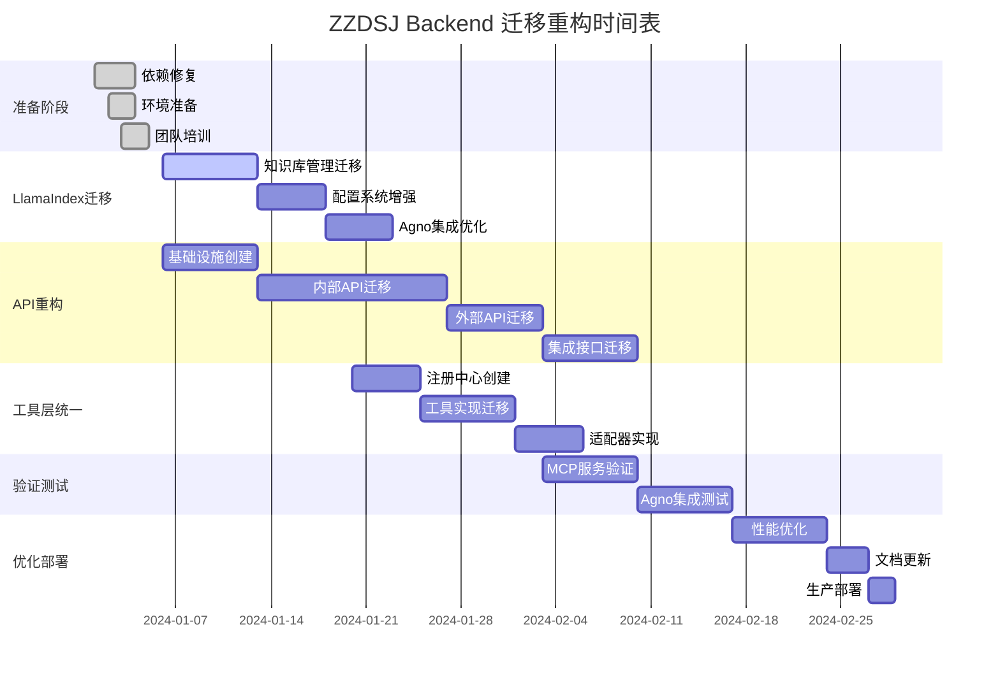

# ZZDSJ Backend API - 完整迁移与重构方案

## 1. 项目概况与现状分析

### 1.1 项目架构现状
- **技术栈**: FastAPI + Agno框架 + LlamaIndex + PostgreSQL + Milvus + Redis
- **代码规模**: 1065个Python文件，24个测试文件（测试覆盖率仅2.25%）
- **架构模式**: 3层架构（API -> Service -> Core -> DB）
- **主要框架**: Agno（智能代理）、LlamaIndex（知识管理）、FastMCP（工具协议）

### 1.2 发现的核心问题

#### 🔴 严重问题
1. **依赖管理混乱**
   - requirements.txt中存在重复依赖包
   - Agno框架依赖被注释但代码大量使用
   - 版本不一致问题（alembic、python-dotenv等）

2. **LlamaIndex集成不完整**
   - 独立封装（llamaindex_complete）功能完整但未迁移
   - 项目中集成（app/frameworks/llamaindex/）功能不完整
   - 知识库管理功能完全缺失

3. **API层结构混乱**
   - frontend/目录承担过多职责（115个接口）
   - v1/外部API设计不完整
   - 三套不同的响应格式并存

4. **工具层架构冲突**
   - app/tools/ 和 core/tools/ 两套并行系统
   - 注册机制不统一
   - 框架集成方式不一致

#### 🟡 中等问题
5. **配置管理复杂**
   - 多层配置文件（env.example、config.yaml、docker-compose）
   - 配置参数分散且可能冲突

6. **测试覆盖不足**
   - 仅2.25%的测试覆盖率
   - 缺乏集成测试和性能测试

## 2. LlamaIndex迁移验证计划

### 2.1 现状对比分析

| 功能模块 | llamaindex_complete状态 | app/frameworks/llamaindex状态 | 迁移优先级 |
|---------|------------------------|------------------------------|------------|
| 知识库管理 | ✅ 完整实现 | ❌ 完全缺失 | 🔴 最高 |
| 配置系统 | ✅ 多环境支持 | ⚠️ 基础配置 | 🔴 最高 |
| API封装 | ✅ 简化接口 | ❌ 缺失 | 🟡 高 |
| 向量存储 | ✅ 多后端自动选择 | ⚠️ 手动配置 | 🟡 中 |
| 文档处理 | ✅ 异步批量处理 | ⚠️ 基础功能 | 🟡 中 |

### 2.2 迁移实施计划

#### 第一阶段：核心知识库管理迁移（1周）
```bash
# 迁移核心文件
cp llamaindex_complete/knowledge_base_manager.py app/frameworks/llamaindex/
cp llamaindex_complete/api_interface.py app/frameworks/llamaindex/

# 更新集成接口
# 修改 app/frameworks/llamaindex/__init__.py
# 添加知识库管理器导出
```

#### 第二阶段：配置系统增强（3-5天）
```bash
# 合并配置功能
# 集成 llamaindex_complete/config.py 的高级功能
# 实现用户自选模型功能
# 添加动态配置加载
```

#### 第三阶段：Agno集成优化（3-5天）
```bash
# 创建统一的配置桥接器
# 实现知识库ID映射
# 优化检索任务传递机制
```

### 2.3 验证测试计划

#### 功能验证测试
```python
# 测试脚本示例
def test_knowledge_base_migration():
    # 测试知识库创建
    kb_id = create_knowledge_base("test_kb")
    assert kb_id is not None
    
    # 测试文档上传
    doc_id = upload_document(kb_id, "test.pdf")
    assert doc_id is not None
    
    # 测试检索功能
    results = search_knowledge_base(kb_id, "test query")
    assert len(results) > 0
```

#### 性能验证测试
- 向量化速度对比
- 检索响应时间对比
- 并发处理能力测试

## 3. API层重构方案

### 3.1 新目录结构设计

```
app/api/
├── internal/                    # 内部管理API
│   ├── v1/                     # 内部API v1版本
│   │   ├── admin/              # 管理员接口
│   │   ├── users/              # 用户管理
│   │   ├── assistants/         # 助手管理
│   │   ├── knowledge/          # 知识库管理
│   │   ├── chat/               # 对话管理
│   │   ├── system/             # 系统设置
│   │   └── tools/              # 工具管理
├── external/                   # 外部开放API
│   ├── v1/                     # 外部API v1版本
│   │   ├── assistants/         # 助手调用
│   │   ├── chat/               # 对话接口
│   │   ├── knowledge/          # 知识查询
│   │   ├── ai/                 # AI能力
│   │   └── tools/              # 工具调用
├── shared/                     # 共享组件
│   ├── exceptions/             # 异常处理
│   ├── responses/              # 响应格式化
│   ├── validators/             # 数据验证
│   └── middleware/             # 共享中间件
└── integration/                # 集成接口
    ├── owl/                    # OWL框架集成
    ├── mcp/                    # MCP服务集成
    └── orchestration/          # 编排服务集成
```

### 3.2 统一响应格式

```json
{
  "success": true,
  "code": 0,
  "message": "操作成功",
  "data": { ... },
  "meta": {
    "timestamp": "2024-01-01T00:00:00Z",
    "request_id": "uuid",
    "version": "v1"
  }
}
```

### 3.3 迁移时间表

| 阶段 | 任务 | 时间 | 责任人 |
|------|------|------|--------|
| 第一阶段 | 创建新目录结构 + 共享组件迁移 | 1-2周 | 架构师 |
| 第二阶段 | 内部API迁移 | 2-3周 | 后端团队 |
| 第三阶段 | 外部API迁移 | 1-2周 | API团队 |
| 第四阶段 | 集成接口迁移 | 1周 | 集成团队 |
| 第五阶段 | 清理和优化 | 1周 | 全团队 |

## 4. 工具层冲突解决方案

### 4.1 工具层冲突分析

#### 当前状态
- **app/tools/**: 业务层工具实现（Agno专用、高级工具、基础工具）
- **core/tools/**: 核心层工具管理（注册管理、执行引擎、配置管理）

#### 冲突问题
1. **注册系统重复**: 两套不同的工具注册机制
2. **管理职责不清**: 工具实现和工具管理边界模糊
3. **框架耦合**: app/tools/与特定框架强耦合

### 4.2 统一工具架构设计

```
tools/
├── core/                       # 核心工具管理层
│   ├── registry/               # 统一注册中心
│   ├── execution/              # 执行引擎
│   ├── discovery/              # 工具发现
│   └── lifecycle/              # 生命周期管理
├── implementations/            # 工具实现层
│   ├── agno/                   # Agno框架专用工具
│   ├── llamaindex/             # LlamaIndex工具
│   ├── search/                 # 搜索工具
│   ├── reasoning/              # 推理工具
│   ├── knowledge/              # 知识管理工具
│   └── system/                 # 系统工具
└── adapters/                   # 框架适配器
    ├── agno_adapter.py         # Agno框架适配器
    ├── llamaindex_adapter.py   # LlamaIndex适配器
    └── mcp_adapter.py          # MCP协议适配器
```

### 4.3 工具层重构步骤

#### 第一步：创建统一注册中心（3-5天）
```python
# 统一工具注册接口
class UnifiedToolRegistry:
    def register_tool(self, tool_class, metadata, framework=None)
    def get_tool(self, tool_id, framework=None)
    def list_tools(self, category=None, framework=None)
    def discover_tools(self, query=None)
```

#### 第二步：迁移工具实现（1-2周）
```bash
# 保持向后兼容的迁移
mv app/tools/ tools/implementations/
mv core/tools/ tools/core/

# 创建适配器层
# 实现框架无关的工具接口
```

#### 第三步：统一管理接口（3-5天）
```python
# 框架适配器实现
class AgnoToolAdapter:
    def adapt_tool(self, tool_instance) -> AgnoTool
    def register_to_agno(self, agent, tool_categories)

class LlamaIndexToolAdapter:
    def adapt_tool(self, tool_instance) -> LlamaIndexTool
    def register_to_llamaindex(self, engine, tool_list)
```

## 5. MCP服务验证计划

### 5.1 MCP服务现状分析

#### 已配置的MCP服务
- FastMCP框架集成：✅ 完成
- Docker部署配置：✅ 完成
- 服务注册机制：✅ 基础实现
- 网络配置：✅ 端口范围10000-65000

#### 需要验证的功能
1. **服务自动部署**：启动时自动部署MCP服务
2. **服务发现**：动态发现和注册MCP服务
3. **负载均衡**：多实例的负载分发
4. **故障恢复**：服务异常时的自动恢复

### 5.2 MCP验证测试计划

#### 功能验证测试
```python
def test_mcp_service_deployment():
    # 测试服务自动部署
    assert deploy_default_mcp_services() == True
    
    # 测试服务发现
    services = discover_mcp_services()
    assert len(services) > 0
    
    # 测试工具调用
    result = call_mcp_tool("search_web", {"query": "test"})
    assert result.success == True

def test_mcp_service_health():
    # 健康检查测试
    health = check_mcp_services_health()
    assert all(service.healthy for service in health)
    
    # 故障恢复测试
    simulate_service_failure("mcp-service-1")
    time.sleep(30)  # 等待自动恢复
    assert is_service_healthy("mcp-service-1")
```

#### 性能验证测试
- 并发调用性能测试
- 服务启动时间测试
- 资源使用监控

### 5.3 MCP服务优化建议

#### 配置优化
```yaml
mcp:
  auto_deploy: true
  default_tools: ["search_web", "python", "terminal", "file_operations"]
  port_range: "10000-65000"
  max_instances: 10
  health_check_interval: 30s
  restart_policy: "unless-stopped"
```

#### 监控配置
```yaml
monitoring:
  enabled: true
  metrics_endpoint: "/metrics"
  health_endpoint: "/health"
  log_level: "INFO"
```

## 6. Agno框架集成验证方案

### 6.1 Agno框架集成现状

#### 已实现功能
- ✅ 六个开发阶段的完整实现
- ✅ 动态Agent创建和配置
- ✅ 三种内置模板系统
- ✅ 智能体编排系统
- ✅ 团队协作功能
- ✅ 模型配置适配器

#### 需要验证的集成点
1. **模型配置**: 多厂商模型的动态切换
2. **工具集成**: 与ZZDSJ工具系统的集成
3. **知识库集成**: 与LlamaIndex的深度集成
4. **模板系统**: 三种模板的完整性验证
5. **编排系统**: 复杂任务的自动编排

### 6.2 Agno集成验证测试

#### 基础功能验证
```python
def test_agno_basic_integration():
    # 测试Agent创建
    agent = create_dynamic_knowledge_agent(
        name="Test Agent",
        user_id="test_user"
    )
    assert agent is not None
    
    # 测试模型配置
    assert agent.model_config is not None
    assert agent.model_config.provider in SUPPORTED_PROVIDERS
    
    # 测试工具加载
    tools = agent.get_available_tools()
    assert len(tools) > 0

def test_agno_template_system():
    # 测试三种内置模板
    templates = get_available_templates()
    assert "BASIC_CONVERSATION" in templates
    assert "KNOWLEDGE_BASE" in templates
    assert "DEEP_THINKING" in templates
    
    # 测试模板实例化
    for template_type in templates:
        agent = create_agent_from_template(template_type)
        assert agent is not None
```

#### 高级功能验证
```python
def test_agno_orchestration():
    # 测试智能体编排
    config = {
        "agents": [
            {"role": "researcher", "template": "KNOWLEDGE_BASE"},
            {"role": "analyzer", "template": "DEEP_THINKING"},
            {"role": "writer", "template": "BASIC_CONVERSATION"}
        ],
        "workflow": "sequential"
    }
    
    team = create_agent_team(config)
    result = team.execute_task("Research and analyze AI trends")
    assert result.success == True

def test_agno_knowledge_integration():
    # 测试知识库集成
    agent = create_knowledge_agent(knowledge_base_ids=["kb_1", "kb_2"])
    
    # 测试知识检索
    result = agent.query("What is machine learning?")
    assert "machine learning" in result.lower()
    
    # 验证引用了知识库内容
    assert hasattr(result, 'sources')
    assert len(result.sources) > 0
```

### 6.3 Agno框架优化建议

#### 性能优化
1. **延迟加载**: 按需加载Agent和工具
2. **缓存机制**: 模型响应和工具结果缓存
3. **连接池**: 数据库和外部服务连接池

#### 可靠性优化
1. **错误恢复**: 自动重试和降级机制
2. **资源管理**: 内存和计算资源监控
3. **日志完善**: 结构化日志和追踪

## 7. 整体实施时间表

### 7.1 项目阶段划分

| 阶段 | 时间 | 主要任务 | 交付物 |
|------|------|----------|--------|
| **准备阶段** | 1周 | 环境准备、依赖修复、团队培训 | 修复的依赖文件、培训文档 |
| **LlamaIndex迁移** | 2-3周 | 知识库管理迁移、配置系统增强 | 完整的LlamaIndex集成 |
| **API层重构** | 4-6周 | 新API结构、接口迁移、测试 | 统一的API架构 |
| **工具层统一** | 2-3周 | 工具注册统一、适配器实现 | 统一的工具管理系统 |
| **集成验证** | 2-3周 | MCP服务验证、Agno集成测试 | 完整的集成测试报告 |
| **优化完善** | 1-2周 | 性能优化、文档更新、部署 | 生产就绪的系统 |

### 7.2 并行执行计划



## 8. 风险评估与应对策略

### 8.1 技术风险

| 风险类型 | 风险等级 | 影响 | 应对策略 |
|----------|----------|------|----------|
| **依赖冲突** | 🟡 中等 | 系统无法启动 | 版本锁定、测试环境验证 |
| **数据迁移** | 🟡 中等 | 数据丢失 | 增量迁移、完整备份 |
| **API兼容性** | 🔴 高 | 客户端调用失败 | 版本并行、渐进切换 |
| **性能下降** | 🟡 中等 | 用户体验影响 | 性能基准、监控告警 |

### 8.2 项目风险

| 风险类型 | 风险等级 | 影响 | 应对策略 |
|----------|----------|------|----------|
| **时间延期** | 🟡 中等 | 项目延期交付 | 关键路径管理、资源调配 |
| **资源不足** | 🟡 中等 | 质量下降 | 优先级排序、外部支持 |
| **需求变更** | 🟡 中等 | 范围蔓延 | 变更控制、影响评估 |

### 8.3 业务风险

| 风险类型 | 风险等级 | 影响 | 应对策略 |
|----------|----------|------|----------|
| **服务中断** | 🔴 高 | 业务停止 | 蓝绿部署、快速回滚 |
| **功能缺失** | 🟡 中等 | 用户投诉 | 功能检查清单、用户测试 |
| **安全漏洞** | 🔴 高 | 数据泄露 | 安全审计、渗透测试 |

## 9. 质量保证计划

### 9.1 测试策略

#### 测试覆盖率目标
- **单元测试**: 从2.25%提升到60%+
- **集成测试**: 新增API集成测试
- **端到端测试**: 核心业务流程测试
- **性能测试**: 负载和压力测试

#### 测试实施计划
```python
# 测试框架配置
pytest_config = {
    "coverage_target": 60,
    "integration_tests": True,
    "performance_tests": True,
    "security_tests": True
}

# 自动化测试流水线
ci_pipeline = {
    "pre_commit": ["lint", "type_check", "unit_tests"],
    "pr_validation": ["integration_tests", "security_scan"],
    "deployment": ["e2e_tests", "performance_tests"]
}
```

### 9.2 代码质量标准

#### 代码规范
- **PEP 8**: Python代码风格标准
- **Type Hints**: 强制类型注解
- **Docstring**: 完整的函数和类文档
- **Error Handling**: 统一的异常处理

#### 代码审查流程
1. **自动检查**: 代码格式、类型检查、安全扫描
2. **同行评审**: 功能逻辑、架构设计审查
3. **架构评审**: 重要变更的架构师审查

### 9.3 监控和告警

#### 系统监控
```yaml
monitoring:
  metrics:
    - system_health
    - api_response_time
    - database_performance
    - cache_hit_rate
    - error_rate
  
  alerts:
    - response_time > 2s
    - error_rate > 1%
    - memory_usage > 80%
    - disk_usage > 85%
```

#### 业务监控
```yaml
business_monitoring:
  key_metrics:
    - agent_creation_success_rate
    - knowledge_query_performance
    - tool_execution_success_rate
    - user_satisfaction_score
  
  dashboards:
    - system_overview
    - api_performance
    - business_metrics
    - error_analysis
```

## 10. 成功标准与验收条件

### 10.1 技术指标

| 指标类型 | 当前状态 | 目标状态 | 验收标准 |
|----------|----------|----------|----------|
| **测试覆盖率** | 2.25% | 60%+ | 自动化测试报告 |
| **API响应时间** | 未知 | <2秒 | 性能测试报告 |
| **系统可用性** | 未知 | 99.9% | 监控数据 |
| **错误率** | 未知 | <1% | 日志分析 |

### 10.2 功能指标

| 功能模块 | 验收标准 |
|----------|----------|
| **知识库管理** | 完整的CRUD操作、检索功能正常 |
| **Agent系统** | 三种模板正常工作、工具调用成功 |
| **API系统** | 内外部API功能完整、格式统一 |
| **工具系统** | 统一注册、多框架适配正常 |

### 10.3 业务指标

| 业务指标 | 目标值 | 验收方式 |
|----------|--------|----------|
| **用户体验** | 无功能缺失投诉 | 用户反馈 |
| **系统稳定性** | 无重大故障 | 运行日志 |
| **部署效率** | 自动化部署 | 部署时间记录 |

## 11. 后续维护计划

### 11.1 维护策略

#### 预防性维护
- **定期更新**: 依赖包、安全补丁
- **性能优化**: 数据库优化、缓存策略
- **监控完善**: 新增业务指标监控

#### 响应性维护
- **故障响应**: 24/7监控、快速响应
- **用户支持**: 问题追踪、解决方案
- **文档维护**: 及时更新技术文档

### 11.2 持续改进

#### 技术债务管理
- **代码重构**: 定期重构老旧代码
- **架构演进**: 根据业务发展调整架构
- **技术更新**: 跟进新技术、框架更新

#### 团队能力建设
- **技能培训**: 新技术、最佳实践培训
- **知识分享**: 内部技术分享、外部交流
- **工具改进**: 开发效率工具、自动化流程

---

## 总结

这份迁移重构方案提供了一个完整、可执行的路径，将ZZDSJ Backend API从当前混乱的状态改造为一个结构清晰、功能完整、易于维护的现代化系统。

**关键成功因素**：
1. **渐进式迁移**: 避免大爆炸式重构，降低风险
2. **充分测试**: 确保每个阶段的质量和稳定性
3. **团队协作**: 明确分工、有效沟通
4. **质量保证**: 严格的代码审查和测试标准

**预期收益**：
- 系统架构清晰，易于理解和维护
- 功能完整，满足业务需求
- 性能稳定，用户体验良好
- 扩展性强，支持未来发展

通过执行这个方案，ZZDSJ项目将获得一个现代化、高质量的后端系统，为未来的发展奠定坚实基础。