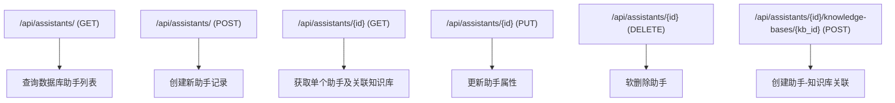
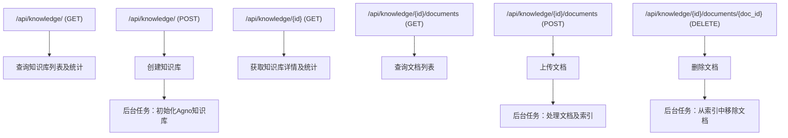
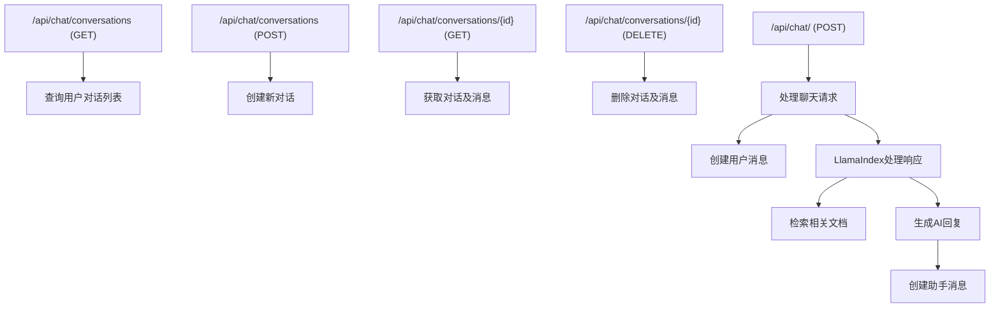
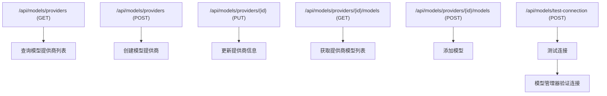
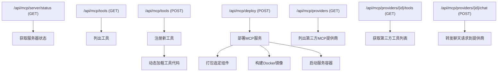
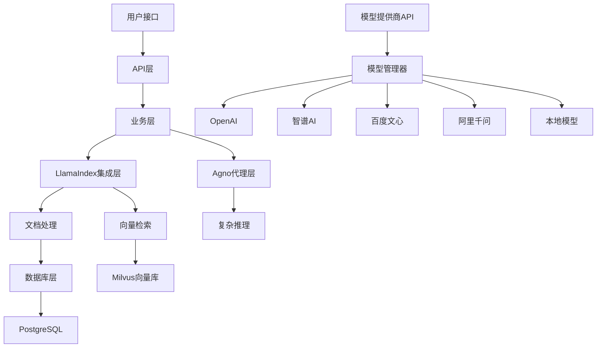

# 智政知识库问答系统接口与业务对应关系文档

本文档详细说明了智政知识库问答系统中API接口与业务逻辑的对应关系、数据流向以及核心业务流程。

## 接口总览

系统API接口按照业务模块分为以下几个主要部分：

1. **助手管理模块** - 管理AI助手的创建、配置和使用
2. **知识库管理模块** - 负责知识库及其文档的管理
3. **对话接口模块** - 处理用户与AI助手之间的交互
4. **模型提供商模块** - 管理不同AI模型服务提供商及其配置
5. **问答助手模块** - 管理产品级问答功能和预设问题
6. **MCP服务模块** - 提供扩展功能的Model Context Protocol服务

## 1. 助手管理模块

### 1.1 API端点

| 端点 | 方法 | 描述 | 权限 |
|------|------|------|------|
| `/api/assistants/` | GET | 获取所有助手列表 | 用户 |
| `/api/assistants/` | POST | 创建新助手 | 管理员 |
| `/api/assistants/{assistant_id}` | GET | 获取助手详情 | 用户 |
| `/api/assistants/{assistant_id}` | PUT | 更新助手信息 | 管理员 |
| `/api/assistants/{assistant_id}` | DELETE | 删除/停用助手 | 管理员 |
| `/api/assistants/{assistant_id}/knowledge-bases/{knowledge_base_id}` | POST | 将知识库关联到助手 | 管理员 |

### 1.2 业务对应关系

### 1.3 数据模型关系

助手模块涉及的主要数据模型：
- `Assistant` - 存储助手基本信息
- `AssistantKnowledgeBase` - 存储助手与知识库的多对多关联

### 1.4 核心业务流程

1. **助手创建流程**：
   - 接收助手创建请求，包含名称、描述、模型等信息
   - 在数据库中创建助手记录
   - 返回创建的助手信息

2. **知识库关联流程**：
   - 验证助手和知识库是否存在
   - 检查关联是否已存在
   - 创建助手与知识库的关联记录

## 2. 知识库管理模块

### 2.1 API端点

| 端点 | 方法 | 描述 | 权限 |
|------|------|------|------|
| `/api/knowledge/` | GET | 获取所有知识库及统计信息 | 用户 |
| `/api/knowledge/` | POST | 创建新知识库 | 管理员 |
| `/api/knowledge/{knowledge_base_id}` | GET | 获取知识库详情及统计 | 用户 |
| `/api/knowledge/{knowledge_base_id}/stats` | GET | 获取知识库详细统计信息 | 用户 |
| `/api/knowledge/{knowledge_base_id}` | PUT | 更新知识库 | 管理员 |
| `/api/knowledge/{knowledge_base_id}` | DELETE | 删除知识库 | 管理员 |
| `/api/knowledge/{knowledge_base_id}/documents` | GET | 获取知识库中的文档 | 用户 |
| `/api/knowledge/{knowledge_base_id}/documents` | POST | 添加文档到知识库 | 管理员 |
| `/api/knowledge/{knowledge_base_id}/documents/{document_id}` | GET | 获取文档详情 | 用户 |
| `/api/knowledge/{knowledge_base_id}/documents/{document_id}` | DELETE | 删除文档 | 管理员 |

### 2.2 业务对应关系

### 2.3 数据模型关系

知识库模块涉及的主要数据模型：
- `KnowledgeBase` - 存储知识库基本信息
- `Document` - 存储文档信息
- `DocumentChunk` - 存储文档分块信息

### 2.4 核心业务流程

1. **知识库创建流程**：
   - 接收知识库创建请求
   - 创建数据库知识库记录
   - 启动后台任务初始化Agno知识库
   - 返回创建的知识库信息

2. **文档处理流程**：
   - 上传文档并创建数据库记录
   - 启动后台任务处理文档
   - 解析文档内容并分块
   - 生成文档嵌入向量
   - 存储向量到Milvus
   - 更新文档状态

## 3. 对话接口模块

### 3.1 API端点

| 端点 | 方法 | 描述 | 权限 |
|------|------|------|------|
| `/api/chat/conversations` | GET | 获取对话列表 | 用户 |
| `/api/chat/conversations` | POST | 创建新对话 | 用户 |
| `/api/chat/conversations/{conversation_id}` | GET | 获取对话及消息 | 用户 |
| `/api/chat/conversations/{conversation_id}` | PUT | 更新对话信息 | 用户 |
| `/api/chat/conversations/{conversation_id}` | DELETE | 删除对话 | 用户 |
| `/api/chat/` | POST | 发送消息并获取AI响应 | 用户 |

### 3.2 业务对应关系

### 3.3 数据模型关系

对话模块涉及的主要数据模型：
- `Conversation` - 存储对话基本信息
- `Message` - 存储消息内容
- `MessageReference` - 存储消息与文档分块的关联

### 3.4 核心业务流程

1. **聊天处理流程**：
   - 接收用户消息
   - 获取或创建对话
   - 创建用户消息记录
   - 使用LlamaIndex处理请求：
     - 检索与查询相关的文档
     - 使用模型生成回复
   - 创建助手消息记录
   - 关联引用的文档分块
   - 返回AI响应

## 4. 模型提供商模块

### 4.1 API端点

| 端点 | 方法 | 描述 | 权限 |
|------|------|------|------|
| `/api/models/providers` | GET | 获取所有模型提供商 | 管理员 |
| `/api/models/providers` | POST | 添加新模型提供商 | 管理员 |
| `/api/models/providers/{provider_id}` | GET | 获取提供商详情 | 管理员 |
| `/api/models/providers/{provider_id}` | PUT | 更新模型提供商 | 管理员 |
| `/api/models/providers/{provider_id}` | DELETE | 删除模型提供商 | 管理员 |
| `/api/models/providers/{provider_id}/models` | GET | 获取提供商模型列表 | 管理员 |
| `/api/models/providers/{provider_id}/models` | POST | 添加新模型 | 管理员 |
| `/api/models/providers/{provider_id}/models/{model_id}` | PUT | 更新模型信息 | 管理员 |
| `/api/models/providers/{provider_id}/models/{model_id}` | DELETE | 删除模型 | 管理员 |
| `/api/models/test-connection` | POST | 测试模型连接 | 管理员 |

### 4.2 业务对应关系

### 4.3 数据模型关系

模型提供商模块涉及的主要数据模型：
- `ModelProvider` - 存储模型提供商信息
- `ModelInfo` - 存储模型信息

### 4.4 核心业务流程

1. **模型提供商配置流程**：
   - 添加新的模型提供商，包括API密钥、基础URL等
   - 配置提供商下的模型
   - 设置默认提供商和默认模型

2. **连接测试流程**：
   - 接收测试请求
   - 构建模型客户端
   - 发送简单请求验证连接
   - 返回测试结果

## 5. MCP服务模块

### 5.1 API端点

| 端点 | 方法 | 描述 | 权限 |
|------|------|------|------|
| `/api/mcp/server/status` | GET | 获取MCP服务器状态 | 管理员 |
| `/api/mcp/server/restart` | POST | 重启MCP服务器 | 管理员 |
| `/api/mcp/tools` | GET | 列出所有MCP工具 | 用户 |
| `/api/mcp/tools/{name}` | GET | 获取特定工具详情 | 用户 |
| `/api/mcp/tools` | POST | 创建新MCP工具 | 管理员 |
| `/api/mcp/resources` | GET | 列出所有MCP资源 | 用户 |
| `/api/mcp/resources/{uri}` | GET | 获取特定资源详情 | 用户 |
| `/api/mcp/resources` | POST | 创建新MCP资源 | 管理员 |
| `/api/mcp/prompts` | GET | 列出所有MCP提示 | 用户 |
| `/api/mcp/prompts/{name}` | GET | 获取特定提示详情 | 用户 |
| `/api/mcp/prompts` | POST | 创建新MCP提示 | 管理员 |
| `/api/mcp/deploy` | POST | 部署MCP服务 | 管理员 |
| `/api/mcp/providers` | GET | 列出第三方MCP提供商 | 用户 |
| `/api/mcp/providers/{provider_id}` | GET | 获取提供商详情 | 用户 |
| `/api/mcp/providers` | POST | 注册新第三方MCP提供商 | 管理员 |
| `/api/mcp/providers/{provider_id}` | DELETE | 删除提供商 | 管理员 |
| `/api/mcp/providers/{provider_id}/tools` | GET | 列出提供商工具 | 用户 |
| `/api/mcp/providers/{provider_id}/tools/{tool_name}/test` | POST | 测试工具 | 用户 |
| `/api/mcp/providers/{provider_id}/chat` | POST | 与提供商聊天 | 用户 |

### 5.2 业务对应关系

### 5.3 核心业务流程

1. **MCP工具创建流程**：
   - 接收工具代码
   - 动态加载和执行代码
   - 注册工具到MCP服务器
   - 返回注册结果

2. **MCP服务部署流程**：
   - 接收部署请求，包含选定工具、资源和提示
   - 生成服务代码
   - 构建Docker镜像
   - 启动服务容器
   - 返回部署信息

## 集成架构关系图

## 主要接口依赖关系

### 前端与API接口对应关系

1. **助手页面**：
   - 使用`/api/assistants/`获取和管理助手
   - 使用`/api/knowledge/`关联知识库

2. **知识库页面**：
   - 使用`/api/knowledge/`管理知识库
   - 使用`/api/knowledge/{id}/documents`管理文档

3. **对话页面**：
   - 使用`/api/chat/conversations`管理对话
   - 使用`/api/chat/`发送和接收消息

4. **模型配置页面**：
   - 使用`/api/models/providers`管理模型提供商
   - 使用`/api/models/test-connection`测试连接

5. **MCP服务页面**：
   - 使用`/api/mcp/tools`管理工具
   - 使用`/api/mcp/deploy`部署服务

## 标准服务版本要求

为确保系统稳定运行和业务接口的正常工作，需要满足以下标准服务版本要求：

### 1. API层依赖

- **FastAPI**: 0.89.0或更高版本
- **Pydantic**: 1.10.0或更高版本
- **SQLAlchemy**: 1.4.41或更高版本
- **Alembic**: 1.8.0或更高版本

### 2. 业务层依赖

- **LlamaIndex**: 0.9.0或更高版本
- **Agno**: 0.9.5或更高版本
- **Haystack**: 2.0.0或更高版本

### 3. 模型接口依赖

- **OpenAI Python**: 1.0.0或更高版本
- **ZhipuAI**: 最新版本
- **Anthropic**: 0.8.0或更高版本
- **Ollama Client**: 0.1.6或更高版本

### 4. 存储接口依赖

- **pymilvus**: 2.3.0或更高版本
- **redis**: 4.5.1或更高版本
- **minio**: 7.1.14或更高版本

### 5. 消息队列依赖

- **celery**: 5.2.7或更高版本
- **pika**: 1.3.2或更高版本

## 关键业务指标

以下是系统主要接口的性能和可靠性目标：

| 接口类型 | 平均响应时间 | 最大响应时间 | 可用性目标 | 并发处理能力 |
|---------|------------|------------|-----------|-----------|
| 助手管理 | <100ms | <500ms | 99.9% | 100/秒 |
| 知识库管理 | <150ms | <1s | 99.9% | 50/秒 |
| 文档上传 | <3s | <30s | 99.5% | 10/秒 |
| 对话创建 | <100ms | <500ms | 99.9% | 100/秒 |
| 消息发送 | <200ms | <1s | 99.9% | 50/秒 |
| AI响应 | <3s | <10s | 99.5% | 20/秒 |
| 模型测试 | <5s | <30s | 99% | 5/秒 |
| MCP工具调用 | <1s | <5s | 99% | 20/秒 |
