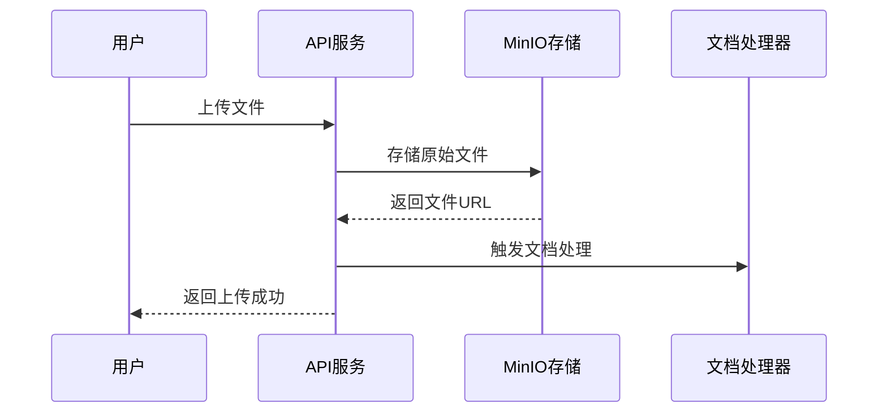
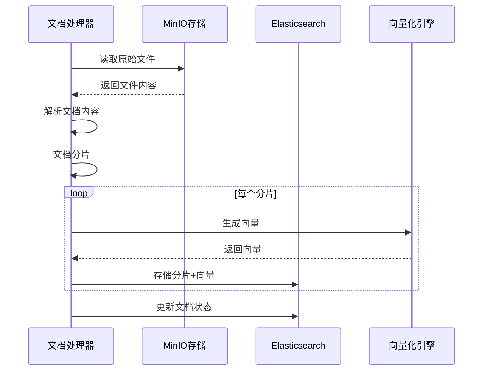
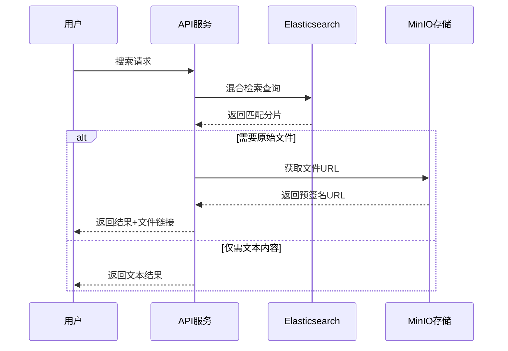

# 智政知识库存储架构指南

## 概述

智政知识库系统采用双存储引擎架构，MinIO和Elasticsearch分别承担不同的存储职责，实现文档存储与检索的最优分工。

## 🏗️ 存储架构总览

```
┌─────────────────────────────────────────────────────────────────┐
│                    智政知识库存储架构                              │
├─────────────────────────────────────────────────────────────────┤
│  用户文件上传                                                     │
│       ↓                                                        │
│  ┌─────────────┐     文档处理      ┌─────────────────────────┐    │
│  │   MinIO     │ ←────────────── │    文档处理引擎          │    │
│  │  对象存储    │                 │  - 解析              │    │
│  │             │                 │  - 分片              │    │
│  │  原始文档    │                 │  - 向量化            │    │
│  │  文件存储    │                 │  - 元数据提取         │    │
│  └─────────────┘                 └─────────────────────────┘    │
│                                           ↓                    │
│                                  ┌─────────────────────────┐    │
│                                  │    Elasticsearch       │    │
│                                  │    混合检索引擎         │    │
│                                  │                        │    │
│                                  │  - 文档分片存储         │    │
│                                  │  - 向量数据            │    │
│                                  │  - 元数据索引          │    │
│                                  │  - 全文检索            │    │
│                                  │  - 语义搜索            │    │
│                                  └─────────────────────────┘    │
└─────────────────────────────────────────────────────────────────┘
```

## 🎯 存储分工

### MinIO - 用户端文件存储引擎

**主要职责：**
- 用户上传文件的原始存储
- 多媒体文件（图片、音视频）存储
- 文档备份与归档
- 临时文件存储

**存储内容：**
```
knowledge-docs/
├── documents/          # 原始文档文件
│   ├── pdf/
│   ├── docx/
│   ├── txt/
│   └── markdown/
├── images/             # 图片文件
├── videos/             # 视频文件
├── audios/             # 音频文件
├── temp/               # 临时文件 (30天自动清理)
├── processed/          # 处理后的文件
└── backups/            # 备份文件 (90天自动清理)
```

**特点：**
- 原始文件完整性保证
- 支持大文件存储
- 生命周期管理
- 私有访问控制
- 预签名URL支持

### Elasticsearch - 文档检索引擎

**主要职责：**
- 文档分片内容存储
- 向量数据索引
- 元数据检索
- 混合搜索实现

**存储结构：**
```json
{
  "document_chunks": {
    "id": "chunk_001",
    "document_id": "doc_123",
    "knowledge_base_id": "kb_456",
    "title": "文档标题",
    "content": "分片文本内容",
    "content_vector": [0.1, 0.2, ...],  // 1536维向量
    "metadata": {
      "source": "example.pdf",
      "page": 1,
      "chunk_index": 0,
      "total_chunks": 10,
      "created_at": "2024-01-01T00:00:00Z"
    }
  }
}
```

**特点：**
- 高性能全文检索
- 语义向量搜索
- 混合检索算法
- 分片数据优化
- 实时索引更新

## 📋 文档处理流程

### 1. 文件上传阶段



**代码示例：**
```python
# 文件上传到MinIO
file_url = await upload_file_to_minio(
    file_data=file.file,
    object_name=f"documents/{kb_id}/{doc_id}/{file.filename}",
    content_type=file.content_type
)

# 创建文档记录
document = await create_document(
    kb_id=kb_id,
    name=file.filename,
    file_path=file_url,
    mime_type=file.content_type,
    user_id=user_id
)
```

### 2. 文档处理阶段



**处理步骤：**
1. **文件读取：** 从MinIO读取原始文件
2. **内容解析：** 根据文件类型解析内容
3. **文档分片：** 按配置策略切分文档
4. **向量化：** 为每个分片生成嵌入向量
5. **索引存储：** 将分片和向量存储到ES

### 3. 检索查询阶段



## ⚙️ 配置管理

### MinIO配置

```yaml
# env.example 中的MinIO配置
MINIO_ENDPOINT=localhost:9000
MINIO_ACCESS_KEY=minioadmin
MINIO_SECRET_KEY=minioadmin
MINIO_BUCKET=knowledge-docs
MINIO_SECURE=false

# Docker Compose 配置
minio:
  image: minio/minio:RELEASE.2023-09-30T07-02-29Z
  ports:
    - "9000:9000"
    - "9001:9001"
  environment:
    MINIO_ROOT_USER: minioadmin
    MINIO_ROOT_PASSWORD: minioadmin
  volumes:
    - minio_data:/data
  command: server /data --console-address ":9001"
```

### Elasticsearch配置

```yaml
# env.example 中的ES配置
ELASTICSEARCH_URL=http://localhost:9200
ELASTICSEARCH_HYBRID_SEARCH=true
ELASTICSEARCH_HYBRID_WEIGHT=0.7
ELASTICSEARCH_INDEX=document_index

# Docker Compose 配置
elasticsearch:
  image: docker.elastic.co/elasticsearch/elasticsearch:8.11.0
  environment:
    - discovery.type=single-node
    - xpack.security.enabled=false
  ports:
    - "9200:9200"
  volumes:
    - elasticsearch_data:/usr/share/elasticsearch/data
```

## 🔧 初始化脚本

### MinIO初始化

```bash
# 运行MinIO初始化脚本
python3 scripts/init_minio.py

# 功能：
# - 创建默认存储桶
# - 设置访问策略
# - 配置生命周期规则
# - 创建目录结构
# - 测试文件操作
```

### Elasticsearch初始化

```bash
# 运行ES初始化脚本
python3 scripts/init_elasticsearch.py

# 功能：
# - 创建索引模板
# - 配置搜索模板
# - 设置文档处理管道
# - 测试混合检索
```

## 📊 存储策略对比

| 存储引擎 | 数据类型 | 访问模式 | 性能特点 | 使用场景 |
|---------|---------|---------|---------|---------|
| **MinIO** | 原始文件 | 少量读取 | 高吞吐量存储 | 文件备份、下载 |
| **Elasticsearch** | 文档分片 | 频繁检索 | 低延迟查询 | 内容搜索、分析 |

## 🔄 数据同步机制

### 文档生命周期

```
创建文档 → MinIO存储 → 文档处理 → ES索引 → 用户检索
    ↓
删除文档 → 清理ES索引 → 可选删除MinIO文件
```

### 一致性保证

1. **写入一致性：** 先写MinIO，后写ES，确保数据不丢失
2. **删除一致性：** 先删ES索引，后删MinIO文件，避免孤儿数据
3. **同步机制：** 通过任务队列确保异步处理的可靠性

## 🛠️ 运维管理

### 监控指标

**MinIO监控：**
- 存储空间使用率
- 文件上传/下载次数
- 错误率统计

**Elasticsearch监控：**
- 索引大小和文档数量
- 查询响应时间
- 混合检索成功率

### 备份策略

**MinIO备份：**
- 原始文件定期备份到云存储
- 重要文档多副本存储

**Elasticsearch备份：**
- 索引快照定期创建
- 元数据备份与恢复

## 💡 最佳实践

### 文件命名规范

```
documents/{kb_id}/{doc_id}/{filename}
```

### 分片策略

- **小文档（<5KB）：** 不分片，直接存储
- **中等文档（5KB-100KB）：** 按段落分片
- **大文档（>100KB）：** 按章节+段落分片

### 性能优化

1. **MinIO优化：**
   - 使用合适的存储桶策略
   - 配置CDN加速文件访问
   - 启用压缩传输

2. **Elasticsearch优化：**
   - 合理设置分片数量
   - 优化向量维度
   - 调整混合检索权重

## 🔍 故障排除

### 常见问题

1. **MinIO连接失败**
   ```bash
   # 检查服务状态
   curl -I http://localhost:9000/minio/health/live
   
   # 运行初始化脚本
   python3 scripts/init_minio.py
   ```

2. **ES索引不一致**
   ```bash
   # 重建索引
   python3 scripts/init_elasticsearch.py
   
   # 重新处理文档
   python3 scripts/reprocess_documents.py
   ```

3. **文档处理失败**
   ```bash
   # 检查处理日志
   tail -f logs/document_processor.log
   
   # 重新触发处理
   POST /api/v1/documents/{doc_id}/reprocess
   ```

## 📚 相关文档

- [混合检索配置指南](HYBRID_SEARCH_GUIDE.md)
- [Docker Compose部署指南](../docker-compose.yml)
- [API文档](../api-docs/)

---

**注意：** 该架构确保了文件存储与检索的分离，MinIO负责原始文件的可靠存储，Elasticsearch负责高性能的文档检索，两者协同工作为用户提供完整的文档管理解决方案。 