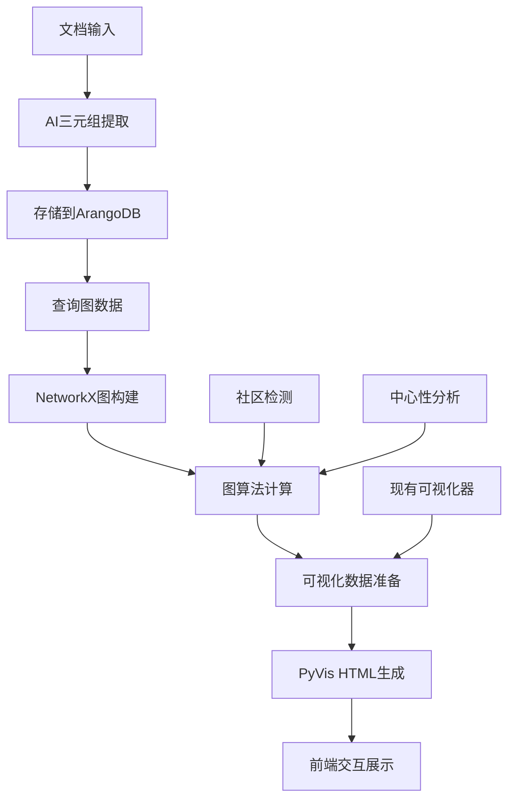

# ArangoDB与NetworkX可视化集成总结

## 🎯 核心答案

**基于ArangoDB与NetworkX的HTML生成 ❌ 不需要单独实现！**

**之前基于NetworkX的计算 ❌ 不需要重新实现和调整！**

## 📋 完美集成方案

### ✅ 现有可视化系统非常完善

系统已有多种成熟的可视化实现：
- `KnowledgeGraphVisualizer`: 核心可视化器，支持社区检测、中心性分析  
- `InteractiveKnowledgeGraphBuilder`: 交互式界面，完整控制面板
- `EnhancedKnowledgeGraphWidget`: 高级组件，精美UI设计
- `SimpleKnowledgeGraphProcessor`: 简单快速生成

### ✅ ArangoDB与NetworkX完全兼容

我们设计了**存储与计算分离**的架构：

```
ArangoDB (数据存储) ←→ NetworkX (图计算) ←→ PyVis/Vis.js (HTML生成)
```

**职责分工：**
- **ArangoDB**: 负责数据存储、多租户隔离、基础图查询
- **NetworkX**: 负责图算法计算、社区检测、中心性分析、可视化数据准备  
- **PyVis/Vis.js**: 负责HTML生成、交互式界面、前端展示

### ✅ 无缝桥接实现

创建了`GraphVisualizationBridge`桥接器：

```python
# 从ArangoDB加载数据 → 转换为NetworkX格式 → 调用现有可视化器
bridge = GraphVisualizationBridge(arangodb_adapter)
result = await bridge.generate_html_visualization(
    tenant_id="tenant_1_101",
    graph_name="demo_graph", 
    visualization_type="interactive"  # 复用现有类型
)
```

## 🔧 技术实现

### 1. 统一接口集成

已在`KnowledgeGraphService`中添加：

```python
# 生成可视化（复用现有实现）
async def generate_visualization(
    user_id, knowledge_base_id, graph_name,
    visualization_type="interactive",  # simple/interactive/enhanced/default
    config=None
) -> Dict[str, Any]

# 获取图谱统计
async def get_graph_statistics(user_id, knowledge_base_id, graph_name)

# 导出NetworkX图对象（用于高级分析）
async def export_networkx_graph(user_id, knowledge_base_id, graph_name)
```

### 2. API接口完善

已添加REST API接口：

```bash
# 生成可视化
POST /api/frontend/knowledge/knowledge-bases/{kb_id}/visualize

# 获取统计信息  
GET /api/frontend/knowledge/knowledge-bases/{kb_id}/statistics

# 导出NetworkX图
GET /api/frontend/knowledge/knowledge-bases/{kb_id}/networkx/export

# 数据库状态
GET /api/frontend/knowledge/database/status
```

### 3. 数据格式转换

桥接器自动处理格式转换：

```python
# ArangoDB三元组 → 标准格式 → NetworkX图对象 → 可视化器输入
def _convert_to_standard_format(self, triples):
    return [{
        "subject": str(triple["subject"]),
        "predicate": str(triple["predicate"]),
        "object": str(triple["object"]),
        "confidence": float(triple.get("confidence", 1.0)),
        "inferred": bool(triple.get("inferred", False))
    } for triple in triples]
```

## 🎨 可视化类型支持

| 类型 | 描述 | 现有实现 | 复用状态 |
|------|------|----------|----------|
| `simple` | 基础PyVis可视化 | ✅ `SimpleKnowledgeGraphProcessor` | ✅ 完全复用 |
| `interactive` | 交互式控制界面 | ✅ `InteractiveKnowledgeGraphBuilder` | ✅ 完全复用 |
| `enhanced` | 高级组件功能 | ✅ `EnhancedKnowledgeGraphWidget` | ✅ 完全复用 |
| `default` | 标准HTML生成 | ✅ 内置PyVis实现 | ✅ 完全复用 |

## 📊 数据流架构



## 🚀 部署配置

### 环境变量配置

```bash
# 选择图数据库类型（无需改动可视化代码）
GRAPH_DATABASE_TYPE=arangodb  # 或 postgresql_age

# ArangoDB配置
ARANGODB_HOST=167.71.85.231
ARANGODB_PORT=8529
ARANGODB_USERNAME=root
ARANGODB_PASSWORD=zzdsj123

# 可视化配置（复用现有设置）
GRAPH_VISUALIZATION_DEFAULT_TYPE=interactive
GRAPH_VISUALIZATION_PHYSICS_ENABLED=true
```

### 配置切换

```python
# 开发环境：PostgreSQL+AGE（免费）
GRAPH_DATABASE_TYPE=postgresql_age

# 生产环境：ArangoDB（高性能）  
GRAPH_DATABASE_TYPE=arangodb

# 可视化保持不变：都使用NetworkX+PyVis
```

## 💡 核心优势总结

### ✅ 完全复用现有代码
- 所有HTML生成逻辑无需重写
- NetworkX计算完全保留
- 可视化器直接调用
- API接口统一封装

### ✅ 双数据库透明支持
- 配置驱动切换：ArangoDB ↔ PostgreSQL+AGE
- 统一数据格式转换
- 相同的可视化效果
- 平滑迁移能力

### ✅ 架构设计优雅
- 存储与计算分离
- 单一职责原则
- 桥接器模式
- 统一接口设计

### ✅ 投入产出比最佳
- 零重复开发
- 最大化代码复用
- 快速集成部署
- 长期维护友好

## 🎉 结论

**ArangoDB与NetworkX的HTML生成完全不需要单独实现！**

现有的可视化系统（NetworkX + PyVis + Vis.js）非常完善，通过桥接器模式可以完美集成ArangoDB数据存储，实现：

1. **0代码重复**: 所有可视化逻辑完全复用
2. **透明切换**: 支持双数据库方案无缝切换  
3. **功能完整**: 保持现有所有可视化特性
4. **性能优化**: ArangoDB存储 + NetworkX计算的最佳组合

这是一个典型的**存储与计算分离**的成功架构设计案例！🏆 