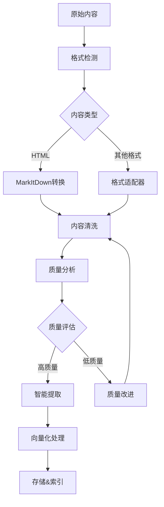

# 智能内容处理集成方案

## 概述

本文档介绍了ZZDSJ后端API项目中智能内容处理功能的完整集成方案。该方案集成了markitdown框架、智能网页爬虫、内容分析和向量化处理功能，为项目提供了强大的网页内容处理能力。

## 架构设计

### 核心组件

```
智能内容处理系统
├── MarkItDown适配器          # 多格式内容转换
├── 增强网页爬虫              # 智能网页采集
├── 智能爬虫调度器            # 自动选择最佳方案
├── 内容质量分析器            # 全方位质量评估
├── 智能内容分析器            # 深度内容解析
└── 政策搜索集成              # 业务场景应用
```

### 数据流程



## 功能模块

### 1. MarkItDown适配器

**文件位置**: `app/tools/advanced/content/markitdown_adapter.py`

**主要功能**:
- 支持HTML、XML、PDF、DOCX等格式转换
- 智能内容清洗和格式优化
- 元数据提取和结构化处理
- 异步处理支持

**核心API**:
```python
from app.tools.advanced.content import get_markitdown_adapter

adapter = get_markitdown_adapter()
await adapter.initialize()

result = adapter.convert_to_markdown(html_content, "html", source_url)
```

**配置项**:
- `markitdown.enabled`: 启用/禁用功能
- `markitdown.timeout`: 处理超时时间
- `markitdown.quality_threshold`: 质量阈值

### 2. 增强网页爬虫

**文件位置**: `app/tools/advanced/search/enhanced_web_crawler.py`

**主要功能**:
- 智能内容采集和质量分析
- 并发处理和错误恢复
- 结构化数据提取
- 重复内容检测

**核心API**:
```python
from app.tools.advanced.search import get_enhanced_web_crawler

crawler = get_enhanced_web_crawler()
await crawler.initialize()

# 单URL爬取
result = await crawler.crawl_url(url)

# 批量爬取
results = await crawler.crawl_urls_batch(urls)
```

**质量分析指标**:
- 文本密度评分
- 结构质量评分
- 内容相关性评分
- 语言质量评分

### 3. 智能爬虫调度器

**文件位置**: `app/tools/advanced/search/intelligent_crawler_scheduler.py`

**主要功能**:
- 自动选择最佳爬取策略
- 模型配置动态获取
- 智能重试机制
- 质量评估和结果融合

**核心API**:
```python
from app.tools.advanced.search import IntelligentCrawlerScheduler

scheduler = IntelligentCrawlerScheduler()
await scheduler.initialize()

result = await scheduler.intelligent_crawl(url)
```

**调度策略**:
- 页面复杂度检测
- 内容类型识别
- 资源使用优化
- 错误处理策略

### 4. 内容质量分析器

**集成位置**: `enhanced_web_crawler.py` 中的 `ContentQualityAnalyzer`

**分析维度**:
- **文本密度**: 有效文本与HTML标签比例
- **结构质量**: 标题层次、段落组织、语义标签
- **内容相关性**: 长度合理性、词汇多样性
- **语言质量**: 句子结构、段落结构、语言识别

**评分算法**:
```python
overall_score = (
    text_density * 0.3 +
    structure_quality * 0.25 +
    content_relevance * 0.25 +
    language_quality * 0.2
)
```

### 5. 智能内容分析器

**文件位置**: `app/tools/advanced/content/intelligent_content_analyzer.py`

**主要功能**:
- 深度文本统计分析
- 结构化内容解析
- 可读性评估
- 语言检测

**分析报告**:
- 内容概览统计
- 结构质量评估
- 可读性指标
- 改进建议

### 6. 政策搜索集成

**文件位置**: `app/tools/advanced/search/policy_search_tool.py`

**增强功能**:
- 智能爬虫结果增强
- 自动内容质量评估
- 多源结果融合
- 配置化智能处理

## 配置管理

### 系统配置项

**文件位置**: `migrations/sql/common/03_crawling_configs.sql`

主要配置类别:

1. **模型配置**
   - LLM提供商设置
   - API密钥管理
   - 模型参数配置

2. **爬虫配置**
   - 并发数控制
   - 超时设置
   - 重试策略

3. **质量控制**
   - 质量阈值设定
   - 内容长度限制
   - 过滤规则

4. **缓存配置**
   - 缓存策略
   - 过期时间
   - 存储选项

### 配置示例

```sql
-- 启用智能爬虫
INSERT INTO system_configs (config_key, config_value, description) 
VALUES ('crawler.intelligent_enabled', 'true', '启用智能爬虫功能');

-- 质量阈值设置
INSERT INTO system_configs (config_key, config_value, description) 
VALUES ('crawler.quality_threshold', '0.6', '内容质量最低阈值');

-- MarkItDown配置
INSERT INTO system_configs (config_key, config_value, description) 
VALUES ('markitdown.enabled', 'true', '启用MarkItDown转换');
```

## 使用指南

### 基础使用

```python
# 1. 简单内容转换
from app.tools.advanced.content import convert_html_to_markdown

result = convert_html_to_markdown(html_content, source_url)

# 2. 智能网页爬取
from app.tools.advanced.search import crawl_and_process_url

result = await crawl_and_process_url(url)

# 3. 批量处理
from app.tools.advanced.search import crawl_and_process_urls

results = await crawl_and_process_urls(urls)
```

### 高级使用

```python
# 1. 自定义配置的爬虫
crawler = get_enhanced_web_crawler()
crawler.config.quality_threshold = 0.8
crawler.config.enable_markitdown = True

result = await crawler.crawl_url(url)

# 2. 智能调度器
scheduler = IntelligentCrawlerScheduler()
scheduler.force_crawler_type = "crawl4ai"  # 强制使用特定爬虫

result = await scheduler.intelligent_crawl(url)

# 3. 内容分析
analyzer = get_intelligent_content_analyzer()
analysis = await analyzer.analyze_content(content, "html", url)
```

### 政策搜索集成

```python
# 增强政策搜索
from app.frameworks.llamaindex.adapters import PolicySearchAdapter

adapter = PolicySearchAdapter()
await adapter.initialize()

# 自动启用智能爬虫增强
results = await adapter.enhanced_policy_search(
    query="数据安全政策",
    enable_intelligent_crawling=True
)
```

## 性能优化

### 并发控制

- **爬虫并发**: 默认5个并发连接
- **处理队列**: 异步任务队列
- **资源限制**: 内存和CPU使用监控

### 缓存策略

- **URL指纹**: 避免重复处理
- **结果缓存**: 临时存储处理结果
- **配置缓存**: 系统配置本地缓存

### 错误处理

- **重试机制**: 智能指数退避
- **降级策略**: 质量不达标时的处理
- **异常恢复**: 自动错误恢复

## 质量保证

### 测试覆盖

1. **单元测试**: 各组件功能测试
2. **集成测试**: 端到端流程测试
3. **性能测试**: 并发处理能力测试
4. **质量测试**: 内容处理质量验证

### 监控指标

- **处理成功率**: 爬取和转换成功率
- **质量分布**: 内容质量评分分布
- **性能指标**: 处理时间和资源使用
- **错误统计**: 错误类型和频率

## 演示和测试

### 演示脚本

**文件位置**: `scripts/demo/intelligent_content_processing_demo.py`

**运行方式**:
```bash
# 完整演示
python scripts/demo/intelligent_content_processing_demo.py full

# 交互式演示
python scripts/demo/intelligent_content_processing_demo.py interactive
```

**演示内容**:
1. MarkItDown内容转换演示
2. 增强网页爬虫演示
3. 智能调度器演示
4. 批量处理演示
5. 方法对比演示

### 测试数据

**内置测试URL**:
- `https://httpbin.org/html` - 简单HTML测试
- `https://httpbin.org/json` - JSON格式测试
- `https://example.com` - 标准网站测试

## 部署建议

### 依赖安装

```bash
# 核心依赖
pip install markitdown
pip install aiohttp beautifulsoup4
pip install llama-index

# 可选增强
pip install crawl4ai  # 高级爬虫支持
pip install playwright  # 浏览器自动化
```

### 环境配置

```env
# MarkItDown配置
MARKITDOWN_ENABLED=true
MARKITDOWN_TIMEOUT=30

# 爬虫配置
CRAWLER_MAX_CONCURRENT=5
CRAWLER_TIMEOUT=30
CRAWLER_QUALITY_THRESHOLD=0.6

# 模型配置
LLM_PROVIDER=openai
OPENAI_API_KEY=your_api_key
```

### 系统要求

- **Python**: 3.8+
- **内存**: 最低4GB，推荐8GB+
- **网络**: 稳定的外网连接
- **存储**: SSD推荐，用于缓存和临时文件

## 故障排除

### 常见问题

1. **MarkItDown初始化失败**
   - 检查依赖安装
   - 验证网络连接
   - 查看日志错误信息

2. **爬虫超时**
   - 增加超时时间设置
   - 检查目标网站可访问性
   - 考虑使用代理

3. **质量评分异常**
   - 检查内容格式
   - 调整质量阈值
   - 查看详细分析结果

4. **配置加载失败**
   - 验证数据库连接
   - 检查配置表结构
   - 确认配置项存在

### 调试方法

```python
import logging
logging.basicConfig(level=logging.DEBUG)

# 启用详细日志
crawler = get_enhanced_web_crawler()
await crawler.initialize()
```

## 扩展开发

### 自定义爬虫

```python
class CustomCrawler(EnhancedWebCrawler):
    async def custom_extraction(self, html_content):
        # 实现自定义提取逻辑
        pass
```

### 自定义质量分析

```python
class CustomQualityAnalyzer(ContentQualityAnalyzer):
    def analyze_custom_metrics(self, content):
        # 实现自定义质量指标
        pass
```

### 新格式支持

```python
class CustomFormatAdapter:
    def convert_custom_format(self, content):
        # 实现新格式转换
        pass
```

## 更新日志

### v1.0.0 (当前版本)
- ✅ MarkItDown框架集成
- ✅ 增强网页爬虫实现
- ✅ 智能调度器开发
- ✅ 内容质量分析系统
- ✅ 政策搜索功能集成
- ✅ 完整配置管理
- ✅ 演示和测试脚本

### 计划功能
- 🔄 向量化处理增强
- 🔄 多语言内容支持
- 🔄 实时处理流水线
- 🔄 机器学习质量模型
- 🔄 分布式处理支持

## 联系方式

如有问题或建议，请联系开发团队或提交Issue到项目仓库。

---

*文档版本: v1.0.0*  
*最后更新: 2024-01-XX*  
*维护团队: ZZDSJ开发组* 