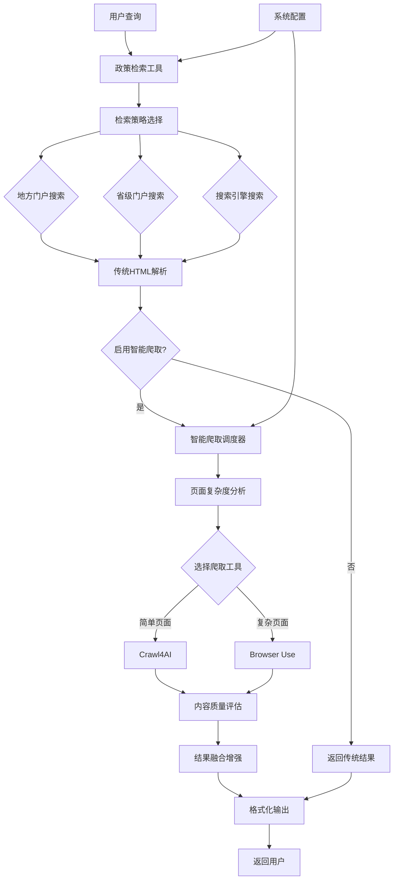

# 智能政策检索系统 - 融合智能爬取

## 概述

智能政策检索系统是一个集成了智能爬取调度器的高级政策文档搜索解决方案。系统结合了传统的网页爬取技术和AI驱动的智能分析，能够自动解析政府门户网站的搜索结果，提供更精确、更结构化的政策信息。

## 核心特性

### 🚀 智能分层检索
- **地方门户优先**: 优先搜索地方政府门户网站
- **省级门户补充**: 地方结果不足时自动升级到省级搜索
- **搜索引擎兜底**: 最终通过搜索引擎进行广泛搜索
- **自动策略切换**: 根据结果质量自动调整检索策略

### 🤖 智能爬取调度
- **自动工具选择**: 根据页面复杂度自动选择Crawl4AI或Browser Use
- **页面结构识别**: 智能识别不同网站的页面结构
- **内容质量评估**: 自动评估爬取内容的质量和准确性
- **智能重试机制**: 失败时自动切换工具并重试

### 📊 系统配置管理
- **模型配置**: 从系统配置中动态获取LLM模型设置
- **爬取参数**: 可配置的爬取超时、并发数等参数
- **质量控制**: 可调整的内容质量阈值和重试策略
- **功能开关**: 灵活的功能启用/禁用控制

## 系统架构



## 核心组件

### 1. 智能爬取调度器 (`IntelligentCrawlerScheduler`)

负责自动选择和调度合适的爬取工具：

```python
from app.tools.advanced.search.intelligent_crawler_scheduler import (
    get_crawler_scheduler,
    smart_crawl_url
)

# 智能爬取单个URL
result = await smart_crawl_url(
    url="https://www.gzlps.gov.cn/search?q=政策",
    task_type="content_extraction",
    extraction_rules=["提取政策标题、发布日期和摘要"],
    timeout=60
)
```

### 2. 增强政策检索工具 (`PolicySearchTool`)

集成了智能爬取功能的主要检索工具：

```python
from app.tools.advanced.search.policy_search_tool import policy_search

# 使用智能爬取的政策检索
result = await policy_search(
    query="创业扶持政策",
    region="六盘水",
    search_strategy="auto",
    enable_intelligent_crawling=True
)
```

### 3. 政策检索适配器 (`PolicySearchAdapter`)

为LlamaIndex代理提供完整的工具集：

```python
from app.frameworks.llamaindex.adapters.policy_search_adapter import (
    get_policy_search_adapter
)

adapter = get_policy_search_adapter()
tools = adapter.get_all_tools()  # 获取所有政策检索工具
```

## 系统配置

### 爬取工具配置

```yaml
# 智能爬取开关
crawling:
  enabled: true
  
# 模型配置
crawling.model:
  provider: "openai"      # openai, anthropic, ollama
  name: "gpt-4o"          # 具体模型名称
  temperature: 0.1        # 温度参数

# 爬取器配置
crawling:
  default_crawler: "auto" # auto, crawl4ai, browser_use
  max_concurrent: 3       # 最大并发数
  timeout: 60            # 超时时间（秒）
  quality_threshold: 0.6  # 质量阈值
  max_retries: 2         # 最大重试次数

# 政策检索增强
policy_search:
  enable_intelligent_crawling: true
  crawl_detail_pages: false
  max_crawl_pages: 5

# Crawl4AI配置
crawl4ai:
  enabled: true
  max_pages: 10
  parallel_mode: true

# Browser Use配置
browser_use:
  enabled: true
  headless: true
  max_tabs: 3
```

### 缓存配置

```yaml
crawling:
  cache_enabled: true
  cache_ttl: 3600  # 1小时缓存
```

## 工具集合

### 1. 增强政策检索工具

```python
# 基础政策检索
result = await enhanced_policy_search(
    query="小微企业税收优惠",
    region="六盘水",
    search_strategy="auto",
    max_results=10,
    include_summary=True,
    enable_intelligent_crawling=True
)
```

### 2. 智能内容分析工具

```python
# 深度分析政策文档
result = await analyze_policy_content(
    url="https://www.gzlps.gov.cn/policy/123.html",
    analysis_type="comprehensive",
    extract_entities=True,
    summarize=True
)
```

### 3. 批量政策爬取工具

```python
# 批量处理政策页面
urls = [
    "https://www.gzlps.gov.cn/policy/1.html",
    "https://www.gzlps.gov.cn/policy/2.html",
    "https://www.gzlps.gov.cn/policy/3.html"
]

result = await batch_crawl_policies(
    urls=urls,
    max_concurrent=3,
    include_analysis=True,
    output_format="structured"
)
```

### 4. 区域查询工具

```python
# 查询可用检索区域
regions = await query_available_regions(level="municipal")
```

### 5. 门户测试工具

```python
# 测试门户连通性
test_result = await test_portal_connectivity(region="六盘水")
```

## 使用示例

### 基础政策检索

```python
import asyncio
from app.tools.advanced.search.policy_search_tool import policy_search

async def search_policies():
    # 智能政策检索
    result = await policy_search(
        query="创新创业扶持政策",
        region="六盘水",
        search_strategy="auto",
        max_results=10,
        enable_intelligent_crawling=True
    )
    
    print(result)

asyncio.run(search_policies())
```

### 深度内容分析

```python
from app.frameworks.llamaindex.adapters.policy_search_adapter import (
    get_policy_search_adapter
)

async def analyze_policy():
    adapter = get_policy_search_adapter()
    
    # 获取智能内容分析工具
    analysis_tool = adapter.create_intelligent_content_analysis_tool()
    
    # 分析政策文档
    result = analysis_tool.fn(
        url="https://www.gzlps.gov.cn/policy/startup-support.html",
        analysis_type="detailed",
        extract_entities=True,
        summarize=True
    )
    
    print(result)

asyncio.run(analyze_policy())
```

### LlamaIndex代理集成

```python
from llama_index.core.agent import OpenAIAgent
from app.frameworks.llamaindex.adapters.policy_search_adapter import (
    integrate_policy_search_to_agent
)

# 创建代理
agent = OpenAIAgent.from_tools([])

# 集成政策检索工具
integrate_policy_search_to_agent(agent)

# 使用代理进行政策检索
response = agent.chat("帮我找一下六盘水市的创业扶持政策")
print(response)
```

## 结果格式

### 检索结果格式

```
🔍 政策检索结果（找到 5 条）
📊 搜索渠道：地方门户
⚡ 智能爬取：已启用
📈 结果质量：0.85

1. **六盘水市创业扶持资金管理办法**
   🔗 链接：https://www.gzlps.gov.cn/policy/123.html
   📅 来源：六盘水市人民政府 (local)
   📆 发布日期：2024-01-15
   📋 政策类型：办法
   🏛️ 发布部门：市发改委
   ⭐ 相关度：0.92
   🤖 解析方式：intelligent_crawl
   🎯 内容质量：0.88
   📄 摘要：为支持创新创业，设立专项资金...
   💡 智能洞察：重点关注小微企业和高新技术企业

🤖 智能分析摘要：
• 成功解析 5/5 个结果
• 平均内容质量：0.86
• 智能爬取提升了内容准确性和结构化程度
```

### 内容分析结果格式

```
🔍 政策内容分析结果

📊 分析质量：0.89
⏱️ 处理时间：3.45秒
🤖 使用工具：crawl4ai

📋 基础信息：
• 标题：六盘水市创业扶持资金管理办法
• 发布部门：六盘水市发展和改革委员会
• 发布日期：2024-01-15
• 政策类型：管理办法

🧠 智能分析：
• 适用范围：全市创新创业企业
• 扶持金额：最高100万元
• 申请条件：注册满1年，员工不少于5人

📝 内容摘要：
本办法旨在促进全市创新创业发展，通过设立专项资金...

🏷️ 实体信息：
• 机构名：六盘水市发展和改革委员会、市财政局
• 金额：100万元、50万元、20万元
• 时间：2024年1月15日、申请截止6月30日
```

## 性能优化

### 1. 缓存策略
- 搜索结果缓存：1小时
- 页面内容缓存：30分钟
- 模型配置缓存：实时更新

### 2. 并发控制
- 默认最大并发数：3
- 可根据系统负载动态调整
- 支持任务优先级排序

### 3. 智能重试
- 失败时自动切换爬取工具
- 超时时间动态调整
- 最大重试次数限制

## 监控和日志

### 性能指标
- 搜索成功率
- 内容质量评分
- 平均响应时间
- 缓存命中率

### 日志记录
- 搜索查询日志
- 爬取任务执行日志
- 错误和异常日志
- 性能监控日志

## 故障排除

### 常见问题

1. **智能爬取失败**
   - 检查模型配置和API密钥
   - 验证目标网站可访问性
   - 调整超时时间和重试策略

2. **结果质量低**
   - 调整质量阈值配置
   - 优化提取规则
   - 检查网站结构变化

3. **性能问题**
   - 调整并发数设置
   - 启用结果缓存
   - 优化模型参数

### 配置验证

```python
# 验证系统配置
from core.system_config.config_manager import SystemConfigManager
from app.models.database import get_db

async def verify_config():
    db = next(get_db())
    config_manager = SystemConfigManager(db)
    
    # 检查关键配置
    crawling_enabled = await config_manager.get_config_value("crawling.enabled")
    model_provider = await config_manager.get_config_value("crawling.model.provider")
    api_key = await config_manager.get_config_value("llm.openai.api_key")
    
    print(f"爬取功能：{'启用' if crawling_enabled else '禁用'}")
    print(f"模型提供商：{model_provider}")
    print(f"API密钥：{'已配置' if api_key else '未配置'}")
```

## 后续发展

### 规划功能
1. **多语言支持**: 支持英文政策文档
2. **语义搜索**: 基于向量相似度的语义匹配
3. **实时更新**: 政策变化的实时监控和通知
4. **API接口**: 提供RESTful API供外部系统调用

### 优化方向
1. **模型微调**: 针对政策文档的专用模型
2. **知识图谱**: 构建政策关系知识图谱
3. **智能推荐**: 基于用户历史的政策推荐
4. **可视化**: 政策内容的可视化展示

## 总结

智能政策检索系统通过融合传统爬取技术和AI智能分析，实现了政策文档搜索的质的飞跃。系统不仅能够自动适应不同网站结构，还能提供高质量的结构化结果，大大提升了政策信息获取的效率和准确性。

通过系统化的配置管理和灵活的工具组合，该系统能够满足不同场景下的政策检索需求，为政府服务数字化提供了强有力的技术支撑。 