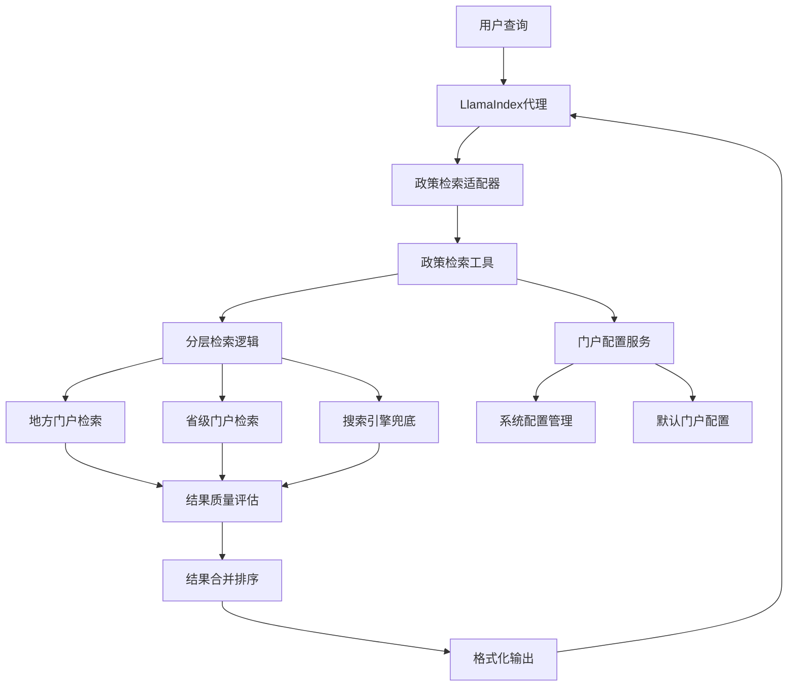

# 政策检索工具实施方案

## 📋 概述

本文档描述了基于政策检索的内置检索工具的完整实施方案。该方案实现了智能分层检索策略，优先使用地方政府门户网站，然后省级门户，最后使用搜索引擎进行兜底检索。

## 🎯 功能特性

### 🔍 核心检索功能
- **分层检索策略**：地方门户 → 省级门户 → 搜索引擎
- **智能质量评估**：根据结果质量自动切换检索层级
- **多种检索模式**：自动、仅地方、仅省级、仅搜索引擎
- **政策类型识别**：自动识别政策文件类型和部门信息
- **相关性评分**：基于关键词匹配和政策特征的评分算法

### ⚙️ 配置管理
- **动态门户配置**：支持后台配置不同地区的政府门户
- **配置验证**：自动验证门户配置的有效性
- **连接测试**：测试门户网站的可访问性
- **配置导入导出**：支持批量导入导出门户配置
- **层级管理**：自动处理地方-省级的层级关系

### 🤖 框架集成
- **LlamaIndex集成**：完全集成到LlamaIndex代理工具链
- **MCP工具标准**：遵循MCP工具协议，支持跨系统集成
- **异步支持**：全面的异步API支持
- **工具组合**：提供多个相关工具的组合使用

## 🏗️ 架构设计

### 技术架构选择

根据项目现有架构，我们采用 **LlamaIndex + MCP工具模式** 的混合架构：



### 组件架构

#### 1. 核心工具层 (`app/tools/advanced/search/`)
- **PolicySearchTool**: 主要的政策检索工具类
- **SearchLevel**: 检索层级枚举
- **PortalConfig**: 门户配置数据类
- **PolicySearchResult**: 检索结果模型

#### 2. 服务层 (`app/services/system/`)
- **PortalConfigService**: 门户配置管理服务
- 支持CRUD操作、连接测试、批量导入导出

#### 3. 适配器层 (`app/frameworks/llamaindex/adapters/`)
- **PolicySearchAdapter**: LlamaIndex集成适配器
- 提供工具创建、代理集成功能

#### 4. API层 (`app/api/frontend/system/`)
- **portal_config.py**: 门户配置管理API
- 提供RESTful接口供前端管理

#### 5. 配置层 (`migrations/sql/common/`)
- 数据库迁移脚本
- 默认配置初始化

## 🚀 部署指南

### 1. 数据库迁移

```bash
# 执行政策检索配置迁移
psql -h localhost -U postgres -d knowledge_qa -f migrations/sql/common/03_policy_search_configs.sql
```

### 2. 环境配置

在 `.env` 文件中添加：

```bash
# 政策检索功能配置
POLICY_SEARCH_ENABLED=true
POLICY_SEARCH_DEFAULT_STRATEGY=auto
POLICY_SEARCH_MAX_RESULTS=10
POLICY_SEARCH_CONNECTION_TIMEOUT=30
POLICY_SEARCH_QUALITY_THRESHOLD=0.6
POLICY_SEARCH_ENABLE_FALLBACK=true
```

### 3. 服务启动

政策检索工具会自动注册到系统中，无需额外配置。

## 📝 使用方法

### 1. 基础使用

```python
from app.tools.advanced.search.policy_search_tool import get_policy_search_tool

# 创建工具实例
tool = get_policy_search_tool()

# 执行搜索
result = await tool._arun(
    query="养老政策",
    region="六盘水",
    search_strategy="auto",
    max_results=10
)
print(result)
```

### 2. LlamaIndex代理集成

```python
from llama_index.core.agent import OpenAIAgent
from app.frameworks.llamaindex.adapters.policy_search_adapter import integrate_policy_search_to_agent

# 创建代理
agent = OpenAIAgent.from_tools([], llm=llm)

# 集成政策检索工具
integrate_policy_search_to_agent(agent)

# 使用代理进行政策检索
response = agent.chat("帮我查找六盘水的企业扶持政策")
```

### 3. MCP工具使用

```python
from app.tools.advanced.search.policy_search_tool import policy_search

# 直接调用MCP注册的函数
result = await policy_search(
    query="教育补贴",
    region="贵州",
    search_strategy="auto",
    max_results=5
)
```

### 4. 门户配置管理

```python
from app.services.system.portal_config_service import get_portal_config_service

service = get_portal_config_service()

# 添加新的门户配置
config = {
    "name": "新城市政府",
    "level": "municipal", 
    "base_url": "https://www.newcity.gov.cn",
    "search_endpoint": "/search",
    "search_params": {"q": "{query}"},
    "encoding": "utf-8",
    "max_results": 10
}

await service.set_portal_config("新城市", config)

# 测试连接
result = await service.test_portal_connection("新城市")
```

## 🔧 配置管理

### 后台管理界面

通过 API 端点 `/api/frontend/system/portal-config` 可以：

1. **查看所有门户配置**
   ```
   GET /api/frontend/system/portal-config/regions
   ```

2. **添加新的门户配置**
   ```
   POST /api/frontend/system/portal-config/regions/{region_name}
   ```

3. **更新门户配置**
   ```
   PUT /api/frontend/system/portal-config/regions/{region_name}
   ```

4. **删除门户配置**
   ```
   DELETE /api/frontend/system/portal-config/regions/{region_name}
   ```

5. **测试门户连接**
   ```
   POST /api/frontend/system/portal-config/regions/{region_name}/test
   ```

6. **批量导入配置**
   ```
   POST /api/frontend/system/portal-config/import
   ```

### 门户配置格式

```json
{
  "name": "门户名称",
  "level": "municipal|provincial|county",
  "parent_region": "父级地区名称",
  "base_url": "https://www.example.gov.cn",
  "search_endpoint": "/search/endpoint",
  "search_params": {
    "param1": "value1",
    "searchWord": "{query}"
  },
  "result_selector": ".result-item",
  "encoding": "utf-8",
  "max_results": 10,
  "region_code": "行政区划代码"
}
```

## 🎮 演示和测试

### 运行演示脚本

```bash
cd zzdsj-backend-api
python scripts/demo/policy_search_demo.py
```

演示包含：
1. 基础政策检索功能
2. 不同检索策略对比
3. 门户配置管理
4. LlamaIndex工具集成
5. MCP工具注册验证

### 测试用例

主要测试场景：
- ✅ 地方门户正常检索
- ✅ 省级门户检索
- ✅ 搜索引擎兜底
- ✅ 质量评估和策略切换
- ✅ 门户配置CRUD操作
- ✅ 连接性测试
- ✅ 工具集成验证

## 📊 监控和优化

### 性能监控

1. **检索耗时统计**
   - 门户响应时间
   - 解析处理时间
   - 总体检索时间

2. **成功率监控**
   - 各门户检索成功率
   - 结果质量分布
   - 策略使用统计

3. **错误追踪**
   - 门户连接失败
   - 解析错误统计
   - 异常情况记录

### 优化建议

1. **缓存优化**
   - 热门查询结果缓存
   - 门户配置缓存
   - 连接状态缓存

2. **并发优化**
   - 多门户并行搜索
   - 异步处理优化
   - 连接池管理

3. **算法优化**
   - 相关性评分算法
   - 质量评估模型
   - 结果去重算法

## 🔮 扩展计划

### 短期扩展
- [ ] 支持更多省市门户配置
- [ ] 增加结果缓存机制
- [ ] 优化HTML解析准确性
- [ ] 添加更多政策类型识别

### 中期扩展
- [ ] 支持PDF文档直接解析
- [ ] 增加OCR识别功能
- [ ] 实现智能摘要生成
- [ ] 添加时间范围过滤

### 长期扩展
- [ ] 基于AI的内容理解
- [ ] 政策关联性分析
- [ ] 个性化推荐算法
- [ ] 多语言支持

## 📚 相关文档

- [MCP工具开发指南](./mcp_tool_development.md)
- [LlamaIndex集成文档](./llamaindex_integration.md)
- [系统配置管理](./system_config_management.md)
- [API接口文档](../api/frontend_api.md)

## 🤝 贡献指南

欢迎贡献代码和建议：

1. **添加新的门户配置**
   - 在 `PortalConfigService` 中添加默认配置
   - 测试门户连接和结果解析
   - 提交配置到数据库

2. **优化解析算法**
   - 改进HTML结构解析
   - 增强政策类型识别
   - 提升相关性评分准确性

3. **扩展功能特性**
   - 添加新的检索策略
   - 实现更多工具集成
   - 增加监控和分析功能

---

**实施状态**: ✅ 已完成  
**技术栈**: LlamaIndex + MCP + FastAPI + PostgreSQL  
**维护团队**: AI系统开发组 